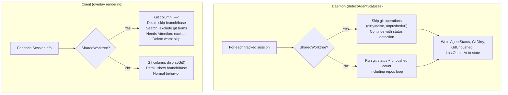

# Design Doc: Hide Git Info for Shared Worktree Sessions

## Background

Graith supports "shared worktree" sessions — sessions that reuse the worktree
of a parent session rather than creating their own. These are created with
`--share-worktree` and require sandbox mode (read-only access). They are used
by features like `/review-tribunal` where multiple agents need to read the same
codebase concurrently without modifications.

The overlay (session picker, `ctrl+b w`) displays git information for every
session: a "Git" column in the compact list showing dirty/unpushed state
(`clean`, `M`, `↑N`), and branch/base details in the detail panel below the
list.

The `SharedWorktree` field is already present on `SessionInfo` in the protocol
(`protocol/messages.go`) and is populated by the daemon in `toSessionInfo()`
(`daemon/handler.go`), so the client already knows which sessions share a
worktree.

## Problem

Shared worktree sessions display redundant git information in the overlay:

- **Identical state**: The git column always mirrors the parent session's state
  since both point at the same worktree directory. Showing it twice adds visual
  noise without new information.
- **Misleading signal**: The `base:` field shown in the detail panel is
  inherited from the source session's `BaseBranch` — not one the shared session
  created or controls. (Note: `Branch` is *not* copied from the source at
  creation time and is typically empty for shared sessions; only `BaseBranch` is
  inherited.) A user unfamiliar with the session tree might think the shared
  session is independently working on that branch.
- **Read-only by definition**: Shared worktree sessions are sandboxed and
  cannot modify the worktree. They can never have uncommitted changes of their
  own, so `dirty` and `unpushedCount` are always reflections of the parent.
- **Wasted computation**: The daemon runs `git status` and
  `git rev-list --count` for every session in `detectAgentStatuses()`, including
  shared worktree sessions. These git operations hit the same worktree the
  parent already checked.
- **False attention signals**: `filterNeedsAttention()` includes stopped
  sessions when `Dirty || UnpushedCount > 0`. A stopped shared session inherits
  the parent's dirty state and appears in "Needs Attention" for work it cannot
  own. Similarly, the overlay's delete confirmation warns about "unsaved work"
  based on inherited `Dirty`/`UnpushedCount`, which is misleading for a
  read-only session whose deletion only removes scratch state.

## Goals

1. Shared worktree sessions show no git information in the overlay — neither in
   the compact list's Git column nor in the detail panel's branch/base line.
2. The daemon skips git status computation for shared worktree sessions,
   avoiding redundant filesystem operations.
3. No protocol changes required — the existing `SharedWorktree` field on
   `SessionInfo` provides everything the client needs.

### Non-Goals

- Showing "inherited from parent" or similar attribution. The simplest UX is
  to just omit the column — the parent session's row already shows the info.
- Targeted changes to how shared worktree sessions appear in `gr list`,
  `gr info`, `gr dashboard`, `gr batch`, or MCP output. However, the
  daemon-side skip (zeroing `GitDirty`/`GitUnpushed`) naturally affects these
  surfaces — shared sessions will show empty/clean git status everywhere. This
  is the correct behavior and is a welcomed side effect, not a targeted change.
  See "Other Surfaces" below for details.

## Proposals

### Proposal 0: Do Nothing

The overlay continues showing identical git info for shared worktree sessions
and their parents. Users of `/review-tribunal` and other shared-worktree
features see duplicated branch/dirty/unpushed data across multiple rows. The
daemon continues running redundant git operations on the same worktree path.
Stopped shared sessions falsely appear in "Needs Attention" and show misleading
"unsaved work" delete warnings.

This is tolerable but adds visual clutter, especially when a tribunal spawns
3-5 shared sessions that all mirror the parent.

### Proposal 1: Suppress Git Display and Skip Computation

Suppress git info display in the overlay for shared worktree sessions, and
skip git status computation in the daemon for those sessions.

#### Client-side changes (`internal/client/overlay.go`)

Five locations need a `SharedWorktree` guard:

1. **`compactDelegate.Render()`** (line ~429): When `si.info.SharedWorktree`
   is true, render the git column as `"—"` (em dash) instead of calling
   `displayGit()`. The dash signals "not applicable" rather than leaving it
   blank (which could look like a rendering bug).

2. **`computeColumnWidths()`** (line ~301): For shared worktree sessions,
   use `"—"` width instead of calling `displayGit()`. The session still
   contributes to the width calculation (the `"—"` string), but inherited
   git state does not inflate the column.

3. **Detail panel** (lines ~1400-1410): When `s.SharedWorktree` is true,
   skip appending `branch:` and `base:` to the detail line. The agent type
   and worktree path are still shown (they remain useful).

4. **`filterNeedsAttention()`** (line ~60): Add `!s.SharedWorktree` to the
   `stopped && (Dirty || UnpushedCount > 0)` case. This prevents shared
   sessions from appearing in "Needs Attention" due to inherited git state.
   The daemon skip makes this largely redundant for running sessions, but the
   overlay guard protects against stale state on stopped sessions.

5. **Delete confirmation** (lines ~1443-1458): When `s.SharedWorktree` is
   true, skip the "unsaved work" warning block. Deleting a shared session
   only removes scratch state — it never touches the shared worktree or
   branch.

#### Search/filter (`internal/client/overlay.go`)

6. **`buildMatchString()`** (lines ~263-281): For shared worktree sessions,
   exclude all git-derived search terms: `dirty`/`clean`/`unpushed` keywords
   *and* `s.Branch`. The detail panel hides branch/base for shared sessions,
   so search results should not match on hidden data.

#### Daemon-side changes (`internal/daemon/daemon.go`)

7. **`detectAgentStatuses()`** (lines ~2600-2624): Add `sharedWorktree bool`
   to the local `target` struct and populate it during the initial `RLock`
   snapshot (alongside `worktreePath`, `baseBranch`, etc.). When
   `t.sharedWorktree` is true, skip *only* the git operations block — both
   the main worktree check and the included repos loop (lines ~2612-2624).
   The `dirty` and `unpushed` variables remain at their zero values (`false`
   and `0`), which are written to state as usual. Agent status detection,
   `LastOutputAt`, idle checking, and all other loop body logic must still
   run — do **not** use an early `continue`.

**Architecture diagram:**

#### Pros

- Simple — seven small conditionals, no new fields or protocol changes
- Uses the existing `SharedWorktree` field already on `SessionInfo`
- Reduces visual noise in the overlay for tribunal/review workflows
- Fixes latent bugs: shared sessions no longer falsely appear in "Needs
  Attention" or show misleading "unsaved work" delete warnings
- Eliminates redundant git operations on the same worktree path

#### Cons

- The `"—"` in the git column is a new visual convention that isn't
  self-explanatory (mitigated: it aligns with how other tools indicate
  "not applicable")
- Users who want to verify the shared worktree's git state at a glance
  must look at the parent session instead (by design, since the state
  is identical)
- In filtered views (Starred, Active), the parent session may not be
  visible, so the `"—"` has no adjacent context. Acceptable since the
  parent's git state is irrelevant to the shared session's purpose.

## Consensus

TBD — to be filled after review.

## Other Notes

### Other Surfaces

The daemon-side skip (zeroing `GitDirty`/`GitUnpushed` for shared sessions)
naturally affects all consumers of `SessionInfo`, not just the overlay. This
is the correct behavior — shared sessions do not own git state. Surfaces
affected:

| Surface | File | Effect |
|---------|------|--------|
| `gr list` | `cli/list.go:265-277` | Git column shows empty (was parent's state) |
| `gr batch` | `cli/batch.go:106-127` | DIRTY/UNPUSHED columns show empty |
| `gr info` | `cli/info.go:44-53` | Branch line shows empty (already empty for shared) |
| `gr dashboard` | `client/dashboard.go:434-441` | Git column shows empty |
| Status bar | `client/statusbar.go:125-132` | No dirty dot or ↑N when attached to shared session |
| MCP output | `mcp/server.go:448-466` | `dirty`/`unpushed_count` are false/0 |
| CLI delete | `cli/delete.go:129-149` | **Not affected** — re-queries git live on `WorktreePath` |

Note: `gr delete` (CLI path) calls `git.DirtyFiles()` directly on the
worktree rather than using protocol fields. It will still show the parent's
dirty state when deleting a shared session. This is a separate concern from
the overlay — the CLI could add a `SharedWorktree` guard in a follow-up.

### References

- `internal/client/overlay.go` — overlay rendering, column widths, detail panel,
  Needs Attention filter, delete confirmation
- `internal/daemon/daemon.go` — `detectAgentStatuses()` git status loop
- `protocol/messages.go` — `SessionInfo.SharedWorktree` field
- `daemon/handler.go` — `toSessionInfo()` populates `SharedWorktree`
- `daemon/state.go` — `SessionState.SharedWorktree` and `SharedWorktreeSourceID`

### Implementation Notes

- The `SharedWorktree` bool is already on `SessionInfo` and populated in
  `toSessionInfo()` — no protocol or state changes needed
- Add `sharedWorktree bool` to the local `target` struct in
  `detectAgentStatuses()`, populated during the initial `RLock` snapshot
  (alongside `worktreePath`, `baseBranch`, `includes`). Gate only the git
  operations block on `!t.sharedWorktree` — agent status, idle detection,
  `LastOutputAt`, and state writes must still execute
- The includes git loop (lines ~2612-2624) should also be skipped for shared
  sessions. Shared sessions currently have empty `Includes` in state (source
  includes are only copied for sandbox/env setup, not stored in
  `SessionState.Includes`), so this is defensive but correct
- The `"—"` string is already used elsewhere in the overlay (e.g.,
  `displayBranch()` returns `"—"` for in-place sessions)

### Test Plan

The overlay is extensively unit-tested in `internal/client/overlay_test.go`.
The following tests need new shared-worktree cases:

- `TestCompactDelegate_RenderGitStatus` — assert `SharedWorktree: true` +
  `Dirty: true` renders `"—"`, not `"M"`
- `TestComputeColumnWidths` — assert shared sessions contribute `"—"` width
- `TestFilterSessions_GitTokens` — assert filtering by `"dirty"` does not
  surface `SharedWorktree: true` sessions with inherited dirty state;
  assert branch is also excluded from search
- `TestView_ShowsDetailLine` — assert branch/base are omitted for shared
  sessions
- `TestFilterNeedsAttention` — assert stopped shared sessions with
  `Dirty: true` are excluded from "Needs Attention"
- Delete confirmation tests — assert no "unsaved work" warning for shared
  sessions

Daemon-side: add a test asserting that `detectAgentStatuses()` does not call
git operations for shared worktree sessions while still updating agent status.
