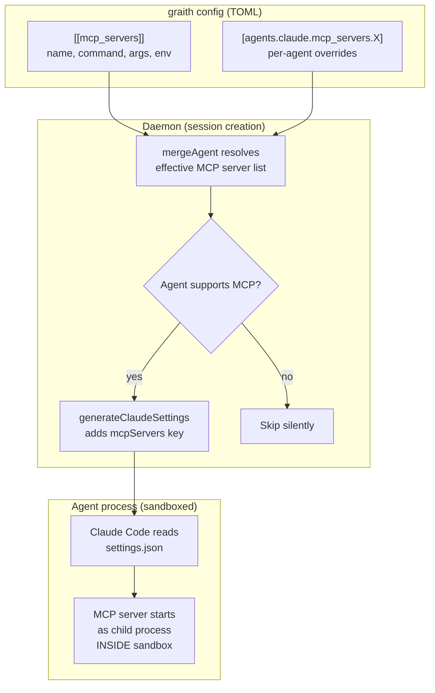
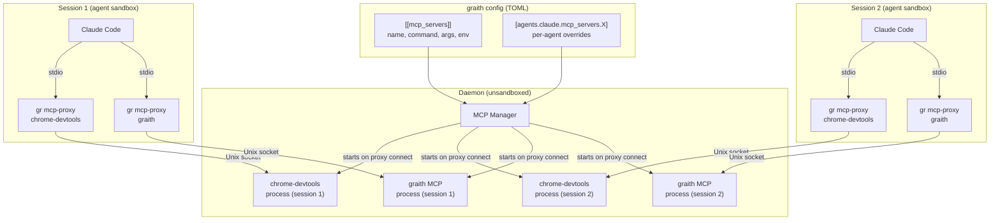

# Design Doc: MCP Server Injection

## Background

graith manages AI coding agent sessions in isolated git worktrees. It already injects lifecycle hooks into agents at session creation — Claude Code gets a `settings.json` with hooks via `--settings`, Codex gets shell scripts via `CODEX_HOOKS_DIR`. This infrastructure is in `internal/daemon/hooks.go`.

The [Model Context Protocol (MCP)](https://modelcontextprotocol.io/) is a standard for connecting AI agents to external tools. graith itself already runs as an MCP server (`gr mcp`) exposing session management tools. Claude Code supports MCP servers via its `settings.json` `mcpServers` key.

- **Parent issue:** [d0ugal/graith#359](https://github.com/d0ugal/graith/issues/359)
- **Motivating use case:** Chrome DevTools MCP crashes inside graith's macOS Seatbelt sandbox due to Chrome's inner sandbox re-init. The workaround is to run Chrome externally and point `chrome-devtools-mcp` at it via `--browserUrl`. This needs a general way to manage MCP servers and proxy them into agent sessions.

## Problem

Agents running inside graith have no access to MCP servers unless the user manually configures them in each agent's own settings. This creates several problems:

- **Sandbox conflicts:** MCP servers that launch sub-processes (Chrome, Playwright) crash inside the Seatbelt sandbox. Users must run these externally and manually wire up connection URLs.
- **Per-agent configuration burden:** Each agent type has its own config format for MCP servers. Users must duplicate MCP server definitions across `~/.claude/settings.json`, Codex config, etc.
- **No central management:** graith manages agent lifecycle but not their tool ecosystem. Adding a new MCP server to all sessions requires editing multiple agent configs manually.
- **Resource waste:** Each agent session launches its own instance of every MCP server. Five sessions using chrome-devtools means five separate MCP server processes, five `npx` downloads.
- **graith's own MCP server is invisible:** `gr mcp` exposes session management tools (list, create, publish messages), but agents don't know about it unless manually configured.

## Goals

1. Users declare MCP servers in graith's TOML config. The **daemon starts and supervises** these MCP server processes.
2. MCP server processes are **managed by the daemon** — one process per active proxy connection, with lifecycle managed centrally (crash recovery, sandbox wrapping, config reload).
3. The daemon **proxies MCP connections** into agent sessions via stdio, so agents see a local MCP server regardless of where the real process runs.
4. MCP servers run **outside the agent sandbox**, solving the sandbox conflict problem entirely.
5. graith's own MCP server (`gr mcp`) is auto-injected into all supporting agents by default.
6. MCP server config supports global and per-agent scoping (enable/disable per agent).
7. Config changes take effect on daemon reload for **existing** MCP server processes. Adding/removing MCP servers from the config takes effect for new sessions only (existing sessions keep their creation-time settings).

### Non-Goals

- **Running MCP servers on remote hosts.** The daemon manages local processes only. Network-based MCP proxying is out of scope.
- **Supporting agents that lack MCP support.** Codex, Agy, and OpenCode do not currently support MCP. When they do, proxy injection handlers will be added. Until then, MCP servers configured globally are silently skipped for unsupported agents.

## Proposals

### Proposal 0: Do nothing

Users continue to manually configure MCP servers in each agent's native config. Chrome DevTools MCP remains unusable inside sandboxed sessions without manual workarounds. graith's own MCP server stays invisible to agents.

### Proposal 1: Config injection only (implemented in v0.22.0)

This was the initial implementation shipped in v0.22.0. Declare MCP servers in graith's TOML config; at session creation, inject the raw command/args into the agent's settings so the **agent launches MCP servers as its own child processes**.

**How it works today:**



#### Limitations

- **MCP servers run inside the sandbox** — Chrome DevTools MCP can't launch Chrome, Playwright can't launch browsers, etc.
- **One MCP server per session** — five sessions = five chrome-devtools-mcp processes, five `npx` downloads.
- **No hot-reload** — config changes require session restart to take effect.
- **Agent manages MCP lifecycle** — if the MCP server crashes, only the agent can restart it. graith has no visibility.

This proposal serves as the stepping stone to Proposal 2.

### Proposal 2: Daemon-managed MCP servers with proxy (recommended)

The daemon starts MCP server processes itself, outside any sandbox, and **proxies MCP connections** into agent sessions via stdio. Each proxy gets its own dedicated MCP server process, managed by the daemon.

**Architecture diagram:**



> **Two-layer sandbox model:** MCP servers run outside the *agent* sandbox (solving the Chrome DevTools problem). Independently, each MCP server process can be wrapped in its *own* daemon-managed sandbox via `sandbox = true` in config. These are two separate sandboxes — the agent sandbox wraps the agent and its children (including `gr mcp-proxy`), while the MCP server sandbox optionally wraps the MCP server process itself.

#### How it works

1. **Daemon reads config** and registers each declared MCP server. MCP server processes are started **lazily** when a proxy first connects (not eagerly on daemon startup).
2. **MCP Manager** in the daemon supervises these processes — restarts on crash with exponential backoff, stops when the proxy disconnects, starts new ones when proxies connect.
3. **Agent sessions get a proxy command** instead of the raw MCP server command. In Claude Code's settings.json:
   ```json
   {
     "mcpServers": {
       "chrome-devtools": {
         "command": "/opt/homebrew/bin/gr",
         "args": ["mcp-proxy", "chrome-devtools"]
       }
     }
   }
   ```
4. **`gr mcp-proxy <name>`** is a lightweight stdio-to-Unix-socket bridge. Claude Code launches it as a child process (inside the agent sandbox). It connects to the daemon over the existing Unix socket and requests a dedicated MCP server process for the named server. The daemon starts a new MCP server process for this proxy and bridges JSON-RPC messages between them.
5. **Each proxy gets its own MCP server process.** MCP is inherently per-client stateful — the `initialize` handshake includes client-specific `roots` (each session has a different worktree), resource subscriptions are per-client, and server→client requests like `sampling/createMessage` have no built-in routing mechanism. A single process has one stdin/stdout pair, so multiple independent connections to one process is not possible without protocol-level multiplexing. Per-proxy processes are the correct and simple solution.
6. **Proxy reconnection:** If the daemon restarts, proxy socket connections break. The proxy detects the broken connection, retries with exponential backoff (1s, 2s, 4s, max 30s), and returns a JSON-RPC error (`{code: -32603, message: "MCP server temporarily unavailable"}`) to any in-flight requests while reconnecting. The daemon starts a fresh MCP server process when the proxy reconnects.
7. **MCP server readiness:** The proxy's own `initialize` request serves as the readiness check. If the MCP server process starts but produces no stdout within 30 seconds, the daemon kills it and the proxy receives a connection error (triggering its reconnect-with-backoff logic).

#### Config format

Same TOML format as Proposal 1, with one addition — an optional `sandbox` boolean:

```toml
[[mcp_servers]]
name = "chrome-devtools"
command = "npx"
args = ["@anthropic-ai/chrome-devtools-mcp@latest"]
sandbox = false  # needs to launch Chrome, can't be sandboxed

[[mcp_servers]]
name = "graith"
command = "gr"
args = ["mcp"]
# sandbox defaults to true — most MCP servers work fine sandboxed
```

The `sandbox` field controls whether the daemon wraps the MCP server process with safehouse. When `true` (the default), the daemon uses the global sandbox config (features, read_dirs, write_dirs) as the base, plus any MCP-server-specific overrides. When `false`, the MCP server runs unsandboxed as a direct child of the daemon.

Default is `true` because most MCP servers work fine in the sandbox — they typically just need network access and read access to a few paths. The user opts out per server for cases like Chrome DevTools where the MCP server needs to launch sub-processes that conflict with the sandbox.

Example with sandbox enabled and server-specific overrides:

```toml
[[mcp_servers]]
name = "filesystem-tools"
command = "npx"
args = ["@anthropic-ai/filesystem-mcp@latest"]
sandbox = true

[mcp_servers.sandbox_config]
read_dirs = ["~/Documents"]
write_dirs = ["~/Documents"]
```

The `sandbox_config` table is optional and follows the same schema as the global `[sandbox]` section. When present, it is merged with the global sandbox config (same merge semantics as agent sandbox — server-specific dirs are appended, server-specific features are appended). When absent, the global sandbox config is used as-is.

Per-agent overrides:

```toml
# Disable chrome-devtools for codex
[agents.codex.mcp_servers.chrome-devtools]
disabled = true
```

No other config format changes needed — the difference is entirely in how the daemon uses the config.

#### Auto-injection of graith MCP server

graith's own MCP server (`gr mcp`) is always injected, even if not declared in config. Since the daemon manages the process, `gr mcp` runs with full access to the daemon's state — no need for the `GRAITH_SESSION_ID` env var hack. The proxy command carries the session context:

```
gr mcp-proxy graith --session <session-id>
```

Users can disable auto-injection per-agent or globally:

```toml
[agents.claude.mcp_servers.graith]
disabled = true
```

#### Proxy protocol

The proxy uses the existing graith Unix socket and framed binary protocol. A new control message type requests an MCP channel:

```json
{"type": "mcp_connect", "payload": {"server": "chrome-devtools", "session_id": "abc123"}}
```

The daemon responds with a channel ID. Subsequent frames on that channel carry raw JSON-RPC bytes between the proxy and the MCP server. The proxy's job is trivial: read stdin → frame and send to daemon → read frames from daemon → write to stdout.

#### MCP server lifecycle

| Event | Behavior |
|-------|----------|
| Daemon starts | Register MCP server configs. No processes started yet (lazy). |
| Proxy connects (`mcp_connect`) | Daemon starts a new MCP server process for this proxy, bridges JSON-RPC. |
| Proxy disconnects | Daemon kills the MCP server process for that proxy. |
| Config reload (`gr daemon reload`) | Register new servers, unregister removed ones. Kill running processes for changed servers (proxies reconnect and get fresh processes). |
| MCP server crashes | Proxy detects EOF, reconnects with backoff. Daemon starts fresh process on reconnect. |
| Daemon stops | Send SIGTERM to all running MCP server processes, wait 5s, SIGKILL. |
| Daemon restarts | Proxy socket connections break. Proxies reconnect with backoff (1s, 2s, 4s, max 30s), returning JSON-RPC errors to in-flight requests while reconnecting. |
| Session created | Inject `gr mcp-proxy <name>` for each enabled MCP server into agent settings. |
| Session resumed | Same injection — proxy reconnects to daemon on first MCP tool call. |

#### Injection mechanism — Claude Code

`generateClaudeSettings()` injects proxy commands instead of raw MCP server commands:

```json
{
  "hooks": { ... },
  "mcpServers": {
    "graith": {
      "command": "/opt/homebrew/bin/gr",
      "args": ["mcp-proxy", "graith", "--session", "abc123"]
    },
    "chrome-devtools": {
      "command": "/opt/homebrew/bin/gr",
      "args": ["mcp-proxy", "chrome-devtools"]
    }
  }
}
```

Claude Code launches `gr mcp-proxy` as a child process (inside the sandbox — it only needs access to the Unix socket). The proxy connects to the daemon, which forwards to the real MCP server running outside the sandbox.

#### Injection mechanism — other agents

Same proxy command, different injection format per agent:

| Agent    | MCP support | Injection mechanism | Proxy command |
|----------|-------------|---------------------|---------------|
| Claude   | Yes | `--settings` flag | `gr mcp-proxy <name>` |
| Codex    | Yes | `--profile graith` flag | `gr mcp-proxy <name>` |
| Agy      | Yes | `.gemini/settings.json` | `gr mcp-proxy <name>` |
| OpenCode | Yes | `OPENCODE_CONFIG_CONTENT` env var | `gr mcp-proxy <name>` |

All agents get the same proxy binary — only the injection format differs.

#### Sandbox interaction

MCP servers run as daemon child processes, **outside the agent sandbox** by default. This solves the core problem: Chrome DevTools MCP can launch Chrome, Playwright can launch browsers, etc. The only thing inside the agent sandbox is `gr mcp-proxy`, which needs read access to the Unix socket.

However, MCP servers can optionally be sandboxed independently via `sandbox = true` in their config. This is useful for MCP servers that don't need elevated privileges — sandboxing them limits blast radius if the server is compromised or misbehaves. The daemon wraps the MCP server command with `safehouse wrap`, using the global sandbox config as the base plus any server-specific `sandbox_config` overrides.

The sandbox config already grants access to the graith data dir (where the Unix socket lives), so no additional sandbox configuration is needed for the proxy.

**Sandbox decision tree for MCP servers:**

| Server needs | `sandbox` setting | Rationale |
|---|---|---|
| Typical MCP server (filesystem, search, etc.) | `true` (default) | Works fine sandboxed |
| Network access to external services | `true` with features | Add `"network"` feature if needed |
| Read/write to specific directories only | `true` with `sandbox_config` | Principle of least privilege |
| Launch sub-processes (Chrome, browsers) | `false` | Sub-process sandbox re-init crashes |
| Full system access (e.g., graith MCP) | `false` | Needs daemon state, Unix socket, etc. |

#### Chrome DevTools use case

With daemon-managed MCP servers, the Chrome DevTools workflow becomes:

1. User adds to graith config:
   ```toml
   [[mcp_servers]]
   name = "chrome-devtools"
   command = "npx"
   args = ["@anthropic-ai/chrome-devtools-mcp@latest"]
   sandbox = false  # needs to launch Chrome
   ```
2. When a session's agent first calls a chrome-devtools MCP tool, the proxy connects to the daemon, which starts a chrome-devtools-mcp process outside the sandbox. Chrome launches automatically.
3. All sessions automatically get chrome-devtools via proxy — agents can navigate pages, take screenshots, run Lighthouse audits, etc.
4. No `--browserUrl` workaround needed. No sandbox conflicts.

#### Hot-reload

When the user changes MCP server config and runs `gr daemon reload` (or the daemon detects config changes):

1. **Changed servers** (command/args/env differ): Running processes for that server are killed. The next time a proxy sends a request, the daemon starts a fresh process with the new command/args. No session restart needed.
2. **Removed servers**: Running processes are stopped. Proxies receive a connection error and return a JSON-RPC error to the agent. The agent sees "MCP server unavailable."
3. **New servers**: Registered in the daemon's config. **However**, existing sessions' `settings.json` was written at creation time and does not include the new server. New servers only appear in sessions created after the config change. This is consistent with how hooks work — session settings are baked at creation time.

A future enhancement could have the daemon signal sessions to update their settings, but this requires agent support for config hot-reload (which Claude Code doesn't have today).

#### Why one process per proxy (not shared)

MCP is inherently per-client stateful. The `initialize` handshake includes client-specific data (`roots` with workspace paths — each graith session has a different worktree), resource subscriptions are per-client, and server→client requests like `sampling/createMessage` have no built-in routing mechanism.

A single process has one stdin/stdout pair. True multiplexing — routing multiple independent MCP sessions through one stdio pipe — would require:
- Wrapping each proxy's JSON-RPC messages with a session identifier
- Routing responses by matching JSON-RPC `id` to originating proxy (with collision avoidance)
- Routing notifications by subscription state
- Handling `initialize` specially (each proxy needs its own, but the protocol expects one per connection)
- Handling server→client requests (`sampling/createMessage`) with no protocol-level routing

This is substantial protocol-level complexity for marginal resource savings. Most users have 2-10 concurrent sessions × 2-3 MCP servers = 4-30 lightweight processes. The resource concern is process count, and even that is low.

**Decision:** One MCP server process per proxy. The daemon manages lifecycle centrally (crash recovery, sandbox wrapping, config reload, stderr capture, readiness detection) even though there are multiple processes. True multiplexing is **not recommended** without MCP protocol changes — it is a protocol-level challenge, not an engineering optimization.

If process count becomes a concern at scale, the right optimization is **lazy lifecycle** — stop the MCP server process when the proxy disconnects, start a fresh one when a proxy reconnects. This avoids multiplexing complexity entirely.

#### Pros

- **Solves the sandbox problem** — MCP servers run outside the agent sandbox, no workarounds needed
- **Centrally managed** — daemon handles lifecycle (crash recovery, sandbox wrapping, config reload, stderr capture, readiness detection) for all MCP server processes
- **Hot-reload** — config changes to existing servers take effect without session recreation
- **Daemon has visibility** — can monitor, restart, and report MCP server status via `gr mcp list/restart/logs`
- **Agent-agnostic** — same proxy command works for all agents
- **Builds on Proposal 1** — config format is unchanged, only the injection mechanism changes
- **Proxy resilience** — reconnects automatically on daemon restart with backoff

#### Cons

- **More complex** — daemon must manage MCP server processes and proxy connections
- **New protocol messages** — `mcp_connect` and MCP channel framing
- **New CLI command** — `gr mcp-proxy` (though it's simple)
- **Latency** — one extra hop (proxy → daemon → MCP server) vs. direct stdio. Negligible for tool calls (tens of ms), but worth measuring.
- **Single point of failure** — if the daemon crashes, all MCP connections drop. Mitigated by daemon's existing restart-and-recover design.

## Migration path

Proposal 1 is already shipped in v0.22.0. The migration to Proposal 2 is:

1. **Config format:** No changes — same `[[mcp_servers]]` TOML format.
2. **Injection:** `generateClaudeSettings()` switches from injecting raw commands to injecting `gr mcp-proxy` commands. Transparent to users.
3. **Daemon:** Add MCP Manager (start/stop/restart MCP server processes) and proxy handler (new protocol message type, channel multiplexing).
4. **CLI:** Add `gr mcp-proxy <name>` command — lightweight stdio bridge.
5. **Existing sessions:** On next resume, they get the new proxy-based settings.json. The proxy command is resolved from the `gr` binary, which is already in the sandbox's read path.

## Consensus

**Proposal 2: Daemon-managed MCP servers with proxy.** The daemon manages MCP server processes (one per proxy connection, started lazily), proxies connections into agent sessions via `gr mcp-proxy`, and handles lifecycle centrally (crash recovery, sandbox wrapping, config reload, stderr capture). MCP servers are sandboxed by default (`sandbox = true`), with opt-out for servers that need to launch sub-processes (e.g., Chrome DevTools). True multiplexing (sharing one MCP server process across sessions) is explicitly rejected — MCP's per-client statefulness makes it a protocol-level challenge, not an engineering optimization. Proposal 1 (config injection, shipped in v0.22.0) will be replaced.

## Review Findings

Proposal 2 was reviewed independently by Claude (Opus 4.6) and Cursor (Gemini 3.1 Pro). Both reviewers arrived at the same critical findings independently, giving high confidence in the conclusions.

### Critical (2/2 agree)

1. **MCP is per-client stateful — multiplexing is not viable.** The original design claimed MCP servers are "stateless per-request for tool calls." This is wrong. The `initialize` handshake includes per-client `roots` (different worktrees per session), resource subscriptions are per-client, and `sampling/createMessage` is server→client with no routing mechanism. Per-proxy processes are the correct approach. The design has been updated to reflect this.

2. **Per-session connections contradicts shared process.** A single process has one stdin/stdout pair. The original design said "one stdio connection per proxy" to a shared process, which is physically impossible. Resolved: one MCP server process per proxy.

3. **Proxy reconnection was unspecified.** Daemon restarts kill MCP server processes but `gr mcp-proxy` processes survive (they're children of the agent). Without reconnect logic, daemon restarts break all MCP tools. Resolved: proxy reconnects with exponential backoff, returns JSON-RPC errors to in-flight requests while reconnecting.

### Important

4. **Hot-reload doesn't cover adding/removing servers** — existing sessions keep their creation-time `settings.json`. Clarified in the hot-reload section.
5. **MCP server readiness** — process running ≠ server ready. Resolved: proxy's `initialize` request is the readiness check; 30s startup timeout for hung processes.
6. **MCP server stderr capture** — needed for debugging. Added to implementation plan.
7. **CLI surface** — `gr mcp list/restart/logs` noted in implementation plan.

### Minor (addressed in implementation notes)

- Channel ID space limits (254 available, documented)
- Handler.go needs a new code path for MCP proxy connections
- Two-layer sandbox model made explicit
- Proxy authorization check on `mcp_connect`
- Large payloads should be validated against 4MB frame limit

## Other Notes

### References

- [Model Context Protocol specification](https://modelcontextprotocol.io/)
- [Claude Code settings.json documentation](https://docs.anthropic.com/en/docs/claude-code/settings)
- [d0ugal/graith#359 — Feature: start Chrome with remote debugging](https://github.com/d0ugal/graith/issues/359)
- [d0ugal/graith#363 — MCP servers run outside the sandbox](https://github.com/d0ugal/graith/issues/363)
- [chrome-devtools-mcp](https://github.com/anthropics/chrome-devtools-mcp)
- Existing hook injection: `internal/daemon/hooks.go`
- Existing config merge: `internal/config/config.go` (`SandboxConfig.Merge()`)
- Existing protocol: `internal/protocol/frame.go`, `internal/protocol/messages.go`

### Implementation Notes (Proposal 2)

- **MCP Manager** (`internal/daemon/mcpmanager.go`): New component in the daemon. Owns a map of `(serverName, proxyID) → *MCPProcess`. Each `MCPProcess` holds the `exec.Cmd`, stdin/stdout pipes, stderr log file, and a health state (running, crashed, backoff). Starts MCP server processes lazily when proxies connect. Exposes `Connect(serverName, proxyID)`, `Disconnect(proxyID)`, `Restart(serverName)`, `Reload(newConfig)`.
- **MCP Proxy protocol:** New message type `mcp_connect` on control channel (0x00). Daemon allocates a new channel ID (0x02+) for MCP traffic. Frames on MCP channels carry raw JSON-RPC bytes. The proxy reads stdin → writes to MCP channel, reads MCP channel → writes to stdout. The handler needs a new code path for MCP proxy connections — this is a fundamentally different client type from session attach (short-circuits after `mcp_connect` into a pure forwarding loop).
- **`gr mcp-proxy` command** (`internal/cli/mcpproxy.go`): Connects to daemon Unix socket, sends `mcp_connect`, then enters a bidirectional copy loop between stdin/stdout and the MCP channel. Includes reconnect-with-backoff logic (1s, 2s, 4s, max 30s) and returns JSON-RPC error `{code: -32603}` to in-flight requests while reconnecting. ~100 lines of code.
- **Config structs:** Extend `MCPServerConfig` with `Sandbox bool` and `SandboxConfig *SandboxConfig` fields. `MergeMCPServers()` from Proposal 1 is reused. The MCP Manager reads `Sandbox` to decide whether to wrap the command with safehouse, and merges `SandboxConfig` with the global sandbox config when present.
- **MCP server stderr capture:** Each MCP server process has its stderr captured to `~/.local/state/graith/mcp/<name>-<proxyID>.log`. Surfaced via `gr mcp logs <name>`.
- **MCP server readiness:** The proxy's `initialize` request is the readiness check. If the server process produces no stdout within 30s of startup, the daemon kills it (proxy gets EOF, triggers reconnect).
- **Settings injection:** `generateClaudeSettings()` changes from injecting `{command: "npx", args: [...]}` to `{command: "gr", args: ["mcp-proxy", name]}`.
- **Daemon state:** Add `MCPServers map[string]MCPServerStatus` to daemon's runtime state (not persisted — rebuilt from config on start). Exposed via `gr mcp list`.
- **CLI surface:** `gr mcp list` (show servers, status, uptime), `gr mcp restart <name>` (manually restart a server), `gr mcp logs <name>` (view server stderr — analogous to `gr logs` for sessions).
- **Proxy authorization:** On `mcp_connect`, the daemon looks up the requesting session's agent and checks the merged MCP server config. Rejects connections to disabled servers.
- **Channel ID space:** The channel field is a `byte` (256 total, 254 for MCP). More than enough for 2-10 sessions × a few servers. On exhaustion, error the `mcp_connect` request.
- **Graceful shutdown:** Daemon's existing shutdown path extended to SIGTERM MCP server processes before exiting.
- **Testing:** Integration tests spawn daemon with MCP config, verify proxy connects, send a JSON-RPC `initialize` request through the proxy, verify response. Additional tests for crash recovery, reconnection, and concurrent proxies.
