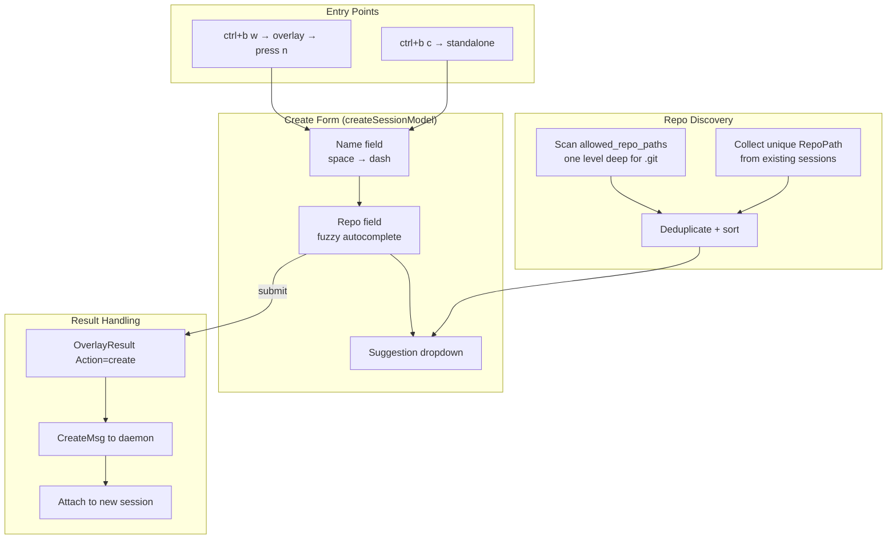

# Design Doc: Overlay Create Session

## Background

graith's session picker overlay (`ctrl+b w`) is the primary UI for managing sessions — it
supports attaching, deleting, restarting, starring, and filtering sessions. However, creating
a new session currently requires either the CLI (`gr new`) or the standalone `ctrl+b c`
shortcut, which only prompts for a session name and inherits the repo from the current session.

There is no way to create a session for a different repo without leaving the TUI and using the
CLI. This is a friction point when working across multiple repositories.

- **Overlay code:** `internal/client/overlay.go` — bubbletea model with states for list,
  filter, confirm-delete, confirm-restart
- **Attach loop:** `internal/cli/attach.go` — handles overlay results and passthrough results
  including `ResultNewSession`
- **Existing name input:** `internal/client/nameinput.go` — standalone bubbletea model with a
  single text field

## Problem

- Creating a session for a repo that isn't the currently attached session's repo requires
  dropping to the CLI (`gr new --repo <path>`). This breaks flow when you're already in the
  TUI.
- The current `ctrl+b c` shortcut only asks for a name and silently inherits the current
  session's repo — there's no way to change it.
- Users have no autocomplete or discovery for repos — they must remember exact paths.

## Goals

1. Add a create-session form accessible from within the overlay (`ctrl+b w`) and the
   standalone new-session shortcut (`ctrl+b c`).
2. The form includes a name field and a repo field with fuzzy autocomplete.
3. Repo suggestions are discovered from `allowed_repo_paths` (scanning one level deep for git
   repos) and existing session repo paths.
4. The name field auto-replaces spaces with dashes for branch-name compatibility.
5. The form is a reusable component shared by both entry points.

### Non-Goals

- Agent type selection in the create form (can be added later as a third field).
- Model or prompt selection.
- Persistent "recent repos" storage — `allowed_repo_paths` plus session-derived repos cover
  the use case without new persistence.

## Proposals

### Proposal 0: Do nothing

Users continue to use `gr new --repo <path>` from the CLI to create sessions for different
repos. The `ctrl+b c` shortcut continues to only ask for a name.

This works but breaks flow — the whole point of the overlay is to avoid dropping to the CLI
for session management. As the number of managed repos grows, this friction compounds.

### Proposal 1: Multi-field form with repo autocomplete

Add a new bubbletea model (`createSessionModel`) with two fields — name and repo — where the
repo field offers fuzzy autocomplete from discovered repos. The form is embedded in the
overlay as a new state and also replaces the standalone `RunNameInput` for `ctrl+b c`.

**Architecture diagram:**



#### Component: `createSessionModel`

A new bubbletea model in `internal/client/createinput.go`.

**Name field** — `textinput.Model`, char limit 64, placeholder `session-name`. The Update
method intercepts space keypresses and inserts `-` instead. Same validation as the existing
`nameInputModel`.

**Repo field** — `textinput.Model` with a suggestions dropdown rendered below it. Defaults to
the current session's repo path (when available) or empty. As the user types, the dropdown
filters to matching repos using case-insensitive substring matching. Arrow keys navigate the
dropdown; enter on a highlighted suggestion fills the field. If no suggestion is selected, the
raw text is used as a literal path.

**Navigation:**
- Tab / Shift+Tab moves focus between fields
- Enter on the name field moves focus to repo
- Enter on the repo field (with no dropdown selection active) submits the form
- Esc cancels and returns to the previous state

**Layout** — centered panel, same visual style as the existing `nameInputModel`:

```
Create Session

  Name: my-feature-branch
  Repo: ~/Code/gra
        ┌──────────────────────────┐
        │ ▸ graith   ~/Code/graith │
        │   grafana  ~/Code/grafana│
        └──────────────────────────┘

  tab next field  enter confirm  esc cancel
```

The existing `nameInputModel` (used by fork) also gets the space-to-dash treatment for
consistency.

#### Repo Discovery

```go
func DiscoverRepos(allowedPaths []string, sessions []protocol.SessionInfo) []RepoSuggestion
```

At form creation time, build the suggestion list by merging two sources:

1. **`allowed_repo_paths`** — for each path, single-level `os.ReadDir`, check for `.git`
   subdirectory. Collect matching dirs as repo candidates.
2. **Existing sessions** — extract unique `RepoPath` values from the current session list.

Deduplicate by resolved absolute path. Sort alphabetically by basename. Display as
`basename  ~/shortened/path`.

Runs once when the form opens. No background scanning or caching. For typical setups (a
`~/Code` dir with fewer than 100 repos), this completes in under a millisecond.

If `allowed_repo_paths` is empty, only session-derived repos appear. If there are no sessions
either, the dropdown is empty and the user types a path manually.

#### Integration: Overlay

New `stateCreate` added to `overlayState`. Pressing `n` in the session list enters this state,
rendering the create form instead of the session list. On submit, the overlay returns an
`OverlayResult` with `Action: "create"` and the new fields. On cancel (esc), returns to
`stateList`.

`OverlayResult` gains two fields:

```go
type OverlayResult struct {
    Action         string
    SessionID      string
    CreateName     string
    CreateRepoPath string
    Collapsed      map[string]bool
}
```

#### Integration: Attach loop

The `ResultOverlay` case in `attach.go` checks for `Action == "create"` and sends a
`CreateMsg` to the daemon — same flow as the current `ResultNewSession` handler.

The existing `ResultNewSession` / `ctrl+b c` handler is updated to use `RunCreateInput`
instead of `RunNameInput`, so both paths share the same form.

New exported function:

```go
func RunCreateInput(defaultRepo string, repos []RepoSuggestion) (name, repoPath string)
```

Returns `("", "")` on cancel.

#### Edge cases

- **Empty repo field on submit:** the form requires a non-empty repo path. Submit is a no-op
  if the repo field is blank.
- **Invalid repo path:** the daemon's create handler already validates the repo path and
  returns an error. The attach loop already handles `CreateMsg` errors by printing the message
  and re-attaching to the current session.
- **No `allowed_repo_paths` configured, no sessions:** the dropdown is empty. The user types
  a path manually — no worse than the current CLI experience.

#### Pros

- Covers 90%+ of create-session use cases without leaving the TUI
- Fuzzy autocomplete makes repo selection fast for users with many repos
- No new persistence — `allowed_repo_paths` config is the source of truth
- Reusable component keeps both entry points consistent
- Minimal protocol changes — reuses existing `CreateMsg`

#### Cons

- Adds ~300-400 lines of new UI code (`createinput.go`)
- Repo discovery depends on `allowed_repo_paths` being configured — empty config means no
  suggestions (but manual input still works)
- No agent type selection yet (acceptable — can be added as a follow-up)

## Consensus

TBD — to be filled after review and discussion.

## Other Notes

### References

- Existing overlay: `internal/client/overlay.go`
- Existing name input: `internal/client/nameinput.go`
- Attach loop: `internal/cli/attach.go`
- Protocol messages: `internal/protocol/messages.go`
- Config with `allowed_repo_paths`: `internal/config/config.go`

### Implementation Notes

- Files to change:
  - `internal/client/createinput.go` — new file: `createSessionModel`, `RunCreateInput`,
    `DiscoverRepos`, `RepoSuggestion`
  - `internal/client/overlay.go` — add `stateCreate`, wire `n` key, embed create model,
    handle submit/cancel
  - `internal/client/nameinput.go` — add space-to-dash interception
  - `internal/cli/attach.go` — handle `OverlayResult.Action == "create"`, update
    `ResultNewSession` to use new form
- The overlay already uses `charm.land/bubbles/v2/textinput` — no new dependencies needed
- `DiscoverRepos` uses only `os.ReadDir` and `os.Stat` — no git operations
- The `RepoSuggestion` struct is intentionally simple (name + path) to keep the autocomplete
  logic straightforward
