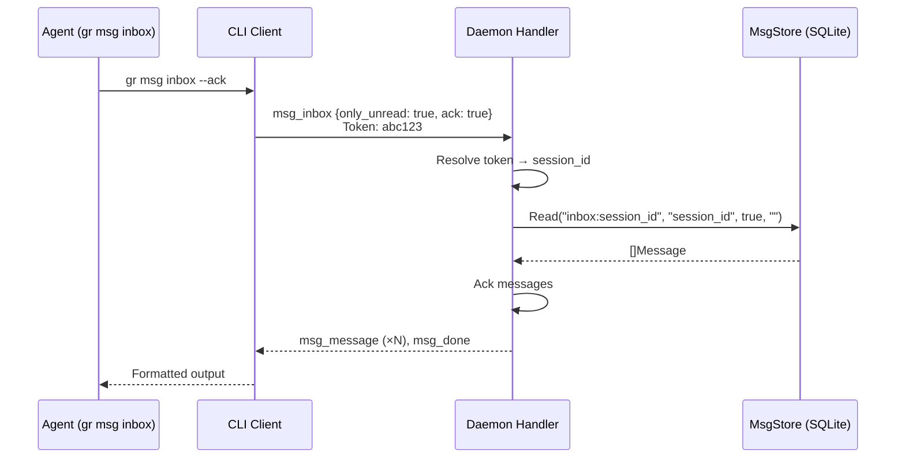

# Inbox Messaging Improvements

**Author:** Dougal Matthews
**Date:** 2026-06-23
**Status:** Draft (revised after two independent reviews)

## Background

Graith agents communicate via a pub/sub messaging system backed by SQLite (`daemon/msgstore.go`). Direct messages use "inbox streams" — topics named `inbox:<session-id>` — published to via `gr msg send <session> <body>` and read via `gr msg sub --topic inbox:<id> --all --ack`.

When a DM arrives, the daemon injects a notification into the recipient's PTY via `notifyInbox()` (`daemon/notify.go`). This is a one-shot write — if the agent misses it (busy output, daemon restarts, session resumes), the message sits unread with no further nudge.

At session start, a `check-inbox` hook fires for Claude, Codex, and Cursor agents (`daemon/hooks.go`). This reads unread messages and outputs a `systemMessage` JSON blob. However, this only runs once at session creation and depends on agent-specific hook wiring.

Since v0.52.0, agents authenticate with `GRAITH_TOKEN` and the daemon resolves session identity from the token. This makes it possible to simplify inbox access without requiring agents to know their own session ID.

## Problem

Three issues with the current inbox design:

- **Agents get the command wrong.** Reading your inbox requires `gr msg sub --topic inbox:<session-id> --all --ack`. Agents frequently mistype the stream name, forget flags, or construct the session ID incorrectly. The `notifyInbox` hint includes the full command but agents still make errors.

- **Missed notifications on restart.** The PTY notification from `notifyInbox()` is fire-and-forget. If the daemon upgrades (adopting live PTYs), the agent restarts, or a session resumes, unread inbox messages produce no notification. The `check-inbox` hook partially covers agent start, but only for agents with hooks enabled, and never for daemon upgrades where the agent process is already running.

- **Inbox namespace leaks through general messaging commands.** Authenticated agents can attempt `gr msg sub --topic inbox:<other-id>`, which is blocked by `checkInboxRead()` (`daemon/auth.go:87`) but still exposes the inbox namespace through the general `sub` command. Additionally, `gr msg topics` (`msgstore.go:277-312`) lists all streams including `inbox:*` — exposing inbox stream names, message counts, and activity for every session. Inbox should be a first-class concept, not a convention layered on top of pub/sub.

## Goals

1. Agents can read their inbox with `gr msg inbox` — no flags, no session ID
2. Unread inbox messages trigger a re-notification on session resume and daemon upgrade adoption, without relying on agent hooks
3. Inbox access is locked down: agents use `gr msg inbox` for their own inbox; `gr msg sub` and `gr msg topics` treat inbox as private

### Non-Goals

- Read receipts visible to the sender — the ack data exists in the DB but exposing it is a separate concern
- Changes to `gr msg send` — sending to another session's inbox works and stays the same
- Changes to pub/sub topics — only inbox stream access is affected
- Removing the `check-inbox` hook — it still provides value at session start for surfacing messages as systemMessage context

## Proposals

### Proposal 0: Do Nothing

Agents continue using `gr msg sub --topic inbox:<id> --all --ack` to read their inbox. The `notifyInbox` hint tells them the exact command, and the `check-inbox` hook covers session start for supported agents.

This works when everything goes right. The problems surface when agents misparse the hint, when sessions restart or the daemon upgrades (losing the one-shot notification), or when new agent types are added without `check-inbox` hook support. As graith adds more multi-agent coordination (scenarios, orchestrator), reliable inbox delivery becomes more important.

### Proposal 1: First-Class Inbox with Re-Notification

Three changes shipped together: a new `gr msg inbox` command backed by a dedicated control message, daemon-side re-notification on resume/restart, and inbox streams removed from `gr msg sub` for authenticated agents.

#### 1. New command: `gr msg inbox`

Add `gr msg inbox` as a subcommand of `gr msg`. It reads the authenticated session's own inbox with no `--topic` flag and no session ID.

**CLI surface:**

```
gr msg inbox              # show unread messages (default)
gr msg inbox --all        # show all messages
gr msg inbox --ack        # mark messages as read after displaying
gr msg inbox --all --ack  # show all and mark read
gr msg inbox --wait       # block until a message arrives
gr msg inbox --follow     # stream new messages continuously
gr msg inbox --thread T   # filter to thread T
```

**Protocol:** New `msg_inbox` control message type. The daemon resolves the inbox stream server-side from the authenticated session's token, so the `inbox:` prefix never appears in the CLI.

```go
// protocol/messages.go
type MsgInboxMsg struct {
    OnlyUnread bool   `json:"only_unread"`
    ThreadID   string `json:"thread_id,omitempty"`
    Wait       bool   `json:"wait"`
    Follow     bool   `json:"follow"`
    Ack        bool   `json:"ack"`
}
```

**`OnlyUnread` default:** Go's zero value for `bool` is `false`. The CLI must explicitly set `OnlyUnread: true` unless `--all` is passed (matching `msg_sub`'s `OnlyUnread: !msgSubAll` at `cli/msg.go:192`). Without this, `gr msg inbox` with no flags would return all messages instead of just unread.

The daemon handler for `msg_inbox`:

1. Rejects unauthenticated connections with a clear error: "msg_inbox requires an authenticated session — use gr msg sub --topic inbox:<id> for debugging" (this preserves the human debug path)
2. Derives the stream as `"inbox:" + auth.sessionID`
3. Sets subscriber to `auth.sessionID`
4. Delegates to a shared `handleMsgStreamRead()` helper (extracted from the current `msg_sub` handler)

This keeps the inbox as a daemon-side concept. The client never needs to know the inbox stream naming convention.

**Shared handler extraction:** The current `msg_sub` handler (`handler.go:558-665`) is ~100 lines with subtle ownership semantics: it subscribes before reading to avoid missing messages, handles per-message ack in follow mode, uses discrete `AckMessages` for thread-filtered reads vs. cursor-based `Ack` for normal reads, and does a bare `return` from the handler to hand reader ownership to a spawned goroutine during follow/wait. Duplicating this for `msg_inbox` would be fragile. Instead, extract:

```go
func (sm *SessionManager) handleMsgStreamRead(
    ctx context.Context,
    sendControl func(string, any),
    reader *protocol.FrameReader,
    stream, subscriber string,
    onlyUnread bool, threadID string,
    wait, follow, ack bool,
) bool // returns true if handler should return (follow/wait took over)
```

`ctx` is required because the existing follow/wait loop exits on `ctx.Done()` (`handler.go:658`). The caller pattern is: `if sm.handleMsgStreamRead(ctx, sendControl, reader, ...) { return }`.

Both `msg_sub` and `msg_inbox` decode their specific message type, resolve stream/subscriber, then delegate to this helper. The existing test coverage for wait/follow/thread/ack behavior (`handler_test.go:1118-1152`) applies to the shared path.

**Architecture diagram:**



#### 2. Re-notify on resume/restart

When a session resumes, restarts, or is adopted during a daemon upgrade, the daemon checks for unread inbox messages and re-injects a PTY notification if any exist.

**Implementation:**

Add `notifyUnreadInbox(sessionID string)` to `SessionManager`:

1. Wait for agent readiness — mirror the existing `notifyInbox` pattern: if a client is attached, call `ptySess.WaitForUserIdle(10*time.Second, 2*time.Minute)` (`notify.go:61-63`); otherwise wait for the first `SessionStart` hook report as a readiness signal (with a timeout fallback of ~5 seconds for agents without hooks)
2. Call `sm.messages.TotalUnread(sessionID)` (`msgstore.go:315-333`) to get the unread count — this uses a single SQL count query without loading message bodies, and is already used by the `status` handler (`handler.go:898-900`)
3. If count > 0, inject via `ptySess.WriteInputAndSubmit()`: `You have N unread inbox message(s). Read: gr msg inbox --all --ack`
4. Call `ptySess.Poke()` to trigger agent status detection

The count is checked **after** the readiness wait, not before. This gives the `check-inbox` hook time to fire and ack messages during agent initialization — if it does, the daemon sees 0 unread and skips the injection. However, this is best-effort, not a hard guarantee: hooks run sequentially (`report-status` then `check-inbox` in `hooks.go:84-88`), so the daemon may observe the `SessionStart` report before `check-inbox` has acked. In that race, both the hook and daemon produce a hint — a duplicate is cheap compared to a missed notification.

**Call sites (always as a goroutine):**

Both call sites must use `go sm.notifyUnreadInbox(sessionID)` — never synchronous. The idle-wait inside `notifyUnreadInbox` can block for up to 2 minutes (`WaitForUserIdle(10s, 2min)`). Calling synchronously would freeze the resume API or serialize fleet adoption.

- **`resumeWithSummary()`** — covers `Resume()`, `Restart()`, and `RestartWithChildren()` (which calls `Restart()` per child, which funnels into `resumeWithSummary()`). This is the single canonical notification point for all resume/restart paths. Spawn the goroutine at the end of `resumeWithSummary`, after `watchSession` is started.
- **`AdoptSessions()`** (`daemon.go:238-274`) — the daemon upgrade path. When `gr daemon restart` succeeds, PTY fds are passed via the upgrade manifest and re-adopted. **Lock-safe scheduling:** `AdoptSessions` holds `sm.mu.Lock()` for the entire adoption loop. Collect adopted session IDs under the lock, save state, unlock, then spawn `go sm.notifyUnreadInbox(id)` for each. Do not call the notification inside the locked loop. For adopted sessions, the agent is already running — use the idle-wait pattern (not the readiness-signal pattern) since there is no `SessionStart` hook.

**Not a call site: cold daemon start.** On a cold start (crash, reboot, `gr daemon stop` + `start`), `cleanupOrphanedProcesses()` (`daemon.go:2445-2490`) kills any orphaned agent processes and marks them stopped. There are no surviving PTYs to inject into — `GetPTY()` returns false and re-notification is a no-op. These sessions are re-notified when subsequently resumed (covered by `resumeWithSummary` above).

**Updated hint text:** The existing `notifyInbox` hint (`daemon/notify.go:60`) changes from:

```
New message from <sender>. Read: gr msg sub --topic inbox:<id> --all --ack | Reply: gr msg send <sender> "<reply>"
```

To:

```
New message from <sender>. Read: gr msg inbox --all --ack | Reply: gr msg send <sender> "<reply>"
```

**Idempotency:** If the `check-inbox` hook also fires on session start, the agent may see both the daemon notification and the hook output. Because the daemon counts unread messages **after** the readiness wait, the hook typically acks first and the daemon sees 0 unread — no duplicate notification. In the rare case both fire, a duplicate hint is cheap compared to a missed one.

**Rate limiting:** To prevent spam during daemon upgrade loops, track `lastInboxNotifyAt` per session in an in-memory `map[string]time.Time` (guarded by `sm.mu`) and skip re-notification if less than 30 seconds have elapsed. This resets on daemon restart, which is acceptable — the rate limiter protects within a single daemon lifetime. Persisting it in `SessionState` would survive restarts but adds schema noise for marginal benefit, since cold restarts already kill orphaned agents (no PTY to spam).

**Auto-resume stopped sessions on inbox message:** When a DM is published to a stopped session's inbox (e.g. via `gr msg send`), the daemon auto-resumes the session. This handles the common case where an agent hits idle timeout — once stopped, incoming messages would otherwise sit unread indefinitely, requiring manual `gr resume` intervention.

Implementation: `notifyInbox()` calls `resumeForInbox()` when `GetPTY()` returns false. `resumeForInbox()` checks the session exists and is in `StatusStopped`, then calls `resumeWithSummary()` with a descriptive lifecycle message ("Resumed by inbox message from \<sender\>"). The resume flow's existing `notifyUnreadInbox()` handles the PTY notification after the agent starts. If the session is not stopped (deleted, creating, or already running), `resumeForInbox` is a no-op. If resume fails (e.g. agent binary not found), the error is logged but does not propagate to the sender — the message is still delivered to the inbox and will be read when the session is eventually resumed manually.

#### 3. Remove inbox from general messaging commands

Lock down `gr msg sub`, `gr msg ack`, and `gr msg topics` so authenticated agents cannot access inbox streams through the general messaging surface. Inbox is accessed exclusively via `gr msg inbox`.

**`msg_sub` handler change** (`handler.go`):

After decoding the `MsgSubMsg`, before processing:

```go
if auth.authenticated {
    if _, isInbox := parseInboxStream(m.Stream); isInbox {
        sendControl("error", protocol.ErrorMsg{
            Message: "inbox streams cannot be read via msg_sub; use gr msg inbox instead",
        })
        continue
    }
}
```

This replaces the current `checkInboxRead()` call for `msg_sub`. The `checkInboxRead` function in `auth.go` can be removed once both `msg_sub` and `msg_ack` inbox blocks are in place — it is called by both handlers (`handler.go:566` and `handler.go:675`). Keep `parseInboxStream` — it is still used by the `msg_pub` handler to trigger `notifyInbox` (`handler.go:552`).

**`msg_ack` handler:** Similarly block `msg_ack` for inbox streams when authenticated. Acking is handled implicitly by `gr msg inbox --ack`.

**`msg_topics` handler:** Filter `inbox:*` streams from `ListStreams` results for authenticated callers. Without this, agents can still enumerate all inbox stream names and message counts via `gr msg topics`, which undercuts the "inbox is private" goal. Either filter in the handler after calling `ListStreams`, or add an `excludeInbox` parameter to `ListStreams` itself. CLI tab-completion for `--topic` also uses `msg_topics` (`cli/completion.go:147-150`), so filtering here also prevents inbox streams from appearing in completions.

**Human access:** Unauthenticated (human CLI) connections retain full access to `sub`, `ack`, and `topics` with inbox streams. This is useful for debugging: `gr msg sub --topic inbox:<id> --all` still works from the terminal.

**`check-inbox` update:** Update `cli/check_inbox.go` to send `msg_inbox` instead of constructing the inbox stream name and sending `msg_sub`. Also update the `systemMessage` text (`check_inbox.go:83-86`) which currently says `gr msg sub --topic inbox:...` — after the lockdown this is exactly the command that gets rejected:

```go
// Before:
c.SendControl("msg_sub", inboxSubMsg(sessionID))
// ...
systemMsg := fmt.Sprintf(
    "You have %d unread message(s) in your graith inbox. Read with: gr msg sub --topic inbox:%s --all\n\n%s",
    len(messages), sessionID, previewStr,
)

// After:
c.SendControl("msg_inbox", protocol.MsgInboxMsg{
    OnlyUnread: true,
    Ack:        true,
})
// ...
systemMsg := fmt.Sprintf(
    "You have %d unread message(s) in your graith inbox. Read with: gr msg inbox --all\n\n%s",
    len(messages), previewStr,
)
```

**MCP tools update:** The MCP server (`internal/mcp/server.go`) has `read_messages` and `subscribe` tools that use `msg_sub` directly (`mcp/server.go:335-343`, `391-399`). After the lockdown, inbox reads via MCP fail for authenticated agents. Add a dedicated `read_inbox` MCP tool that sends `msg_inbox` instead of `msg_sub`. This is preferred over routing `inbox:` topics inside the existing `read_messages` tool — that would mean the MCP layer knows about the `inbox:` prefix convention, which is exactly what this proposal aims to eliminate. The existing `read_messages` and `subscribe` tools should return a clear error if `topic` starts with `inbox:` post-lockdown (helpful for stale tool calls). Also add `read_inbox` to `internal/cli/mcp.go`'s tool list.

**Security note:** The inbox lockdown applies to cooperative/authenticated agents only. An agent that strips `GRAITH_TOKEN` (e.g. `env -u GRAITH_TOKEN gr msg sub --topic inbox:<id>`) is treated as an unauthenticated human with full access — this is the accepted limitation from the token auth design (`docs/design/2026-06-22-agent-auth.md:77-80`). The sandbox is the boundary that prevents agents from trivially stripping their token. `gr doctor` already warns when sandbox is disabled.

**Rollout order:** To reduce migration breakage, ship in this order within the same release:
1. Add `msg_inbox` control message + `gr msg inbox` CLI + MCP `read_inbox` tool
2. Update `notifyInbox` hint text, `check-inbox` hook + systemMessage, default agent instructions, and docs
3. Enforce authenticated inbox block in `msg_sub`, `msg_ack`, and `msg_topics`

Running sessions need a full restart (`gr restart <session>`, not just `gr daemon restart`) to pick up the new `gr` binary and regenerated hooks. `gr daemon restart` preserves PTYs but does not regenerate hook scripts — old hooks using `msg_sub` for inbox reads will silently fail after lockdown step 3 (`check_inbox.go:59-60` returns nil on error). Pre-token sessions adopted across upgrades may also lack `GRAITH_TOKEN` in their environment, causing `gr msg inbox` to be rejected as unauthenticated.

#### 4. CLI Surface: Inboxes vs Topics

After these changes, messaging splits cleanly into two paths with no overlap. Agents never need to think about "streams" — they either read their own inbox or interact with shared topics.

**Inbox path** — private, 1:1 messages between sessions:

| Command | Description |
|---------|-------------|
| `gr msg send <session> "body"` | Send a DM to a session's inbox |
| `gr msg send --parent "body"` | Send a DM to your parent session |
| `gr msg send --children "body"` | Send a DM to all child sessions |
| `gr msg inbox` | Read your unread inbox messages |
| `gr msg inbox --all` | Read all inbox messages |
| `gr msg inbox --all --ack` | Read all and mark as read |
| `gr msg inbox --wait` | Block until a new message arrives |
| `gr msg inbox --follow` | Stream new messages continuously |
| `gr msg inbox --thread T` | Filter to a specific thread |

**Topic path** — shared, broadcast channels:

| Command | Description |
|---------|-------------|
| `gr msg pub --topic <name> "body"` | Publish to a shared topic |
| `gr msg pub --topic <name> --file f` | Publish file contents to a topic |
| `gr msg sub --topic <name> --all` | Read all messages on a topic |
| `gr msg sub --topic <name> --wait` | Block until a message arrives |
| `gr msg sub --topic <name> --follow` | Stream new messages continuously |
| `gr msg sub --topic <name> --ack` | Mark messages as read |
| `gr msg topics` | List all topics (inbox streams excluded) |

**Key rules after the lockdown:**
- `gr msg sub` rejects `inbox:*` streams for authenticated agents
- `gr msg topics` never shows `inbox:*` streams to authenticated agents
- `gr msg inbox` requires authentication — unauthenticated callers use `gr msg sub --topic inbox:<id>` for debugging
- `gr msg send` is unchanged in behavior — it publishes to the target's inbox stream and triggers `notifyInbox`. The success output (`cli/msg.go:157`) changes from `Sent to inbox:%s` to `Sent to %s` to avoid leaking the stream naming convention

##### Workflow: Agent-to-Agent DM

A complete inbox workflow between two sessions in a scenario — "backend" sends a question to "frontend" and waits for the reply.

```
# Session "backend" sends a DM to "frontend"
$ gr msg send frontend "I need the trace export endpoint URL. What path did you settle on?"

# Meanwhile, session "frontend" receives a PTY notification:
#   New message from backend. Read: gr msg inbox --all --ack | Reply: gr msg send backend "<reply>"

# "frontend" reads its inbox (agent-mode auto-enables --json; one JSON object per line)
$ gr msg inbox --all --ack
{"id":"msg_a1b2c3d4","sender_name":"backend","body":"I need the trace export endpoint URL. What path did you settle on?","created_at":"2026-06-23T14:30:00Z"}

# "frontend" replies
$ gr msg send backend "Using /api/v1/traces/export — it's already wired up in router.go"

# "backend" picks up the reply (was blocked waiting)
$ gr msg inbox --wait --ack
{"id":"msg_e5f6g7h8","sender_name":"frontend","body":"Using /api/v1/traces/export — it's already wired up in router.go","created_at":"2026-06-23T14:30:12Z"}
```

If "backend" restarts before reading the reply, the daemon re-injects:
```
You have 1 unread inbox message(s). Read: gr msg inbox --all --ack
```

No session IDs in any agent command. No `--topic inbox:` anywhere.

##### Workflow: Broadcast via Topics

A complete topic workflow — an orchestrator publishes a code review request, multiple agents subscribe.

```
# Orchestrator publishes a review request to a shared topic
$ gr msg pub --topic code-review "PR #42 is ready. Please review changes in handler.go and auth.go"

# Session "reviewer-1" reads the topic (one JSON object per line in agent mode)
$ gr msg sub --topic code-review --all --ack
{"id":"msg_r1s2t3u4","sender_name":"orchestrator","body":"PR #42 is ready. Please review changes in handler.go and auth.go","created_at":"2026-06-23T15:00:00Z"}

# Session "reviewer-2" independently reads the same topic
$ gr msg sub --topic code-review --all --ack
{"id":"msg_r1s2t3u4","sender_name":"orchestrator","body":"PR #42 is ready. Please review changes in handler.go and auth.go","created_at":"2026-06-23T15:00:00Z"}

# Each reviewer publishes findings back to the topic
$ gr msg pub --topic code-review "LGTM on handler.go. auth.go:45 has a nil check that should use errors.Is"
$ gr msg pub --topic code-review "handler.go:120 — race on sm.mu, needs RLock not Lock for read path"

# Orchestrator collects all feedback
$ gr msg sub --topic code-review --all
{"id":"msg_r1s2t3u4","sender_name":"orchestrator","body":"PR #42 is ready. Please review changes in handler.go and auth.go","created_at":"2026-06-23T15:00:00Z"}
{"id":"msg_v5w6x7y8","sender_name":"reviewer-1","body":"LGTM on handler.go. auth.go:45 has a nil check that should use errors.Is","created_at":"2026-06-23T15:01:30Z"}
{"id":"msg_z9a0b1c2","sender_name":"reviewer-2","body":"handler.go:120 — race on sm.mu, needs RLock not Lock for read path","created_at":"2026-06-23T15:02:15Z"}

# List available topics (inbox streams never appear here for authenticated agents)
$ gr msg topics
{"streams":[{"name":"code-review","total":3,"unread":0,"latest_at":"2026-06-23T15:02:15Z"}]}
```

Topics are broadcast — any session can read and publish. There is no PTY notification for topics (only inbox DMs trigger `notifyInbox`). Topics are for coordination; inboxes are for directed communication.

#### Pros

- Dramatically simpler for agents — `gr msg inbox` vs. `gr msg sub --topic inbox:<session-id> --all --ack`
- Eliminates a class of agent errors (wrong stream name, missing flags)
- Daemon owns inbox delivery end-to-end — notifications survive restarts without relying on hooks
- Clean separation: inbox is private (per-session, via `msg_inbox`), topics are shared (via `msg sub`)
- Token-based resolution means no session ID in the command at all
- Inbox namespace fully removed from general messaging surface (`sub`, `ack`, `topics`, completions)

#### Cons

- New control message type and shared handler helper add daemon code
- Breaking change for agents that manually run `gr msg sub --topic inbox:...` or use MCP inbox reads — must update to `gr msg inbox` / `read_inbox`
- Dual notification on session start (hook + daemon) is possible but mitigated by count-after-wait
- Token stripping still bypasses the lockdown (accepted limitation, consistent with auth design)

## Consensus

TBD — to be filled after review and discussion.

## Other Notes

### References

- `internal/daemon/notify.go` — `notifyInbox()` PTY injection
- `internal/daemon/handler.go:558` — `msg_sub` handler
- `internal/daemon/handler.go:686` — `msg_topics` handler
- `internal/daemon/auth.go:87` — `checkInboxRead()` authorization
- `internal/daemon/auth.go:101` — `parseInboxStream()` helper
- `internal/daemon/msgstore.go:315` — `TotalUnread()` count query
- `internal/cli/check_inbox.go` — `check-inbox` hook command
- `internal/cli/msg.go` — `gr msg` CLI commands
- `internal/cli/completion.go:147` — `--topic` tab completion
- `internal/mcp/server.go:335` — MCP `read_messages` tool
- `internal/daemon/hooks.go` — hook generation for Claude/Codex/Cursor
- `internal/daemon/msgstore.go` — SQLite message store and ack tracking
- `internal/daemon/daemon.go:238` — `AdoptSessions()` upgrade adoption
- `internal/protocol/messages.go` — control message type definitions
- `docs/design/2026-06-22-agent-auth.md` — agent token authentication design

### Implementation Notes

| File | Change |
|------|--------|
| `protocol/messages.go` | Add `MsgInboxMsg` struct |
| `daemon/handler.go` | Extract `handleMsgStreamRead()` helper from `msg_sub`; add `msg_inbox` handler case; block inbox from `msg_sub`, `msg_ack`, and `msg_topics` for authenticated agents |
| `daemon/auth.go` | Remove `checkInboxRead()` (replaced by inbox block in handler); keep `parseInboxStream` |
| `daemon/notify.go` | Update hint text to `gr msg inbox`; add `notifyUnreadInbox()` using `TotalUnread()` with idle-wait; add `resumeForInbox()` to auto-resume stopped sessions on inbox message |
| `daemon/daemon.go` | Call `go sm.notifyUnreadInbox()` at end of `resumeWithSummary()`; collect adopted IDs in `AdoptSessions()`, spawn notification goroutines after unlock; add in-memory `lastInboxNotifyAt` rate limiter |
| `cli/msg_inbox.go` | New file: `msgInboxCmd` cobra command (must set `OnlyUnread: true` unless `--all`) |
| `cli/msg.go` | Register `msgInboxCmd` under `msgCmd`; change `Sent to inbox:%s` to `Sent to %s` at line 157 |
| `cli/check_inbox.go` | Switch from `msg_sub` to `msg_inbox` control message; update `systemMessage` text to reference `gr msg inbox` |
| `mcp/server.go` | Add dedicated `read_inbox` MCP tool using `msg_inbox`; return clear error from `read_messages`/`subscribe` if topic starts with `inbox:` |
| `cli/mcp.go` | Add `read_inbox` to MCP tool list |
| `internal/config/default_config.toml` | Update embedded agent instructions to reference `gr msg inbox` |
| `docs/site/messaging.md` | Update inbox examples |
| `docs/site/patterns.md` | Update `gr msg sub --topic inbox:...` examples |
| `docs/site/orchestrator.md` | Update inbox examples |
| `docs/site/scenarios.md` | Update inbox examples |
| `AGENTS.md` | Update messaging examples |
| `docs/design/2026-06-22-agent-auth.md` | Add `msg_inbox` row to authorization matrix; update `msg_sub` row from "own inbox only" to "inbox streams rejected" |

**Tests:**

| File | Change |
|------|--------|
| `daemon/handler_test.go` | Add `msg_inbox` tests; test authenticated `msg_sub` on `inbox:*` rejected; test `msg_ack` on `inbox:*` rejected; test `msg_topics` filters `inbox:*` for authenticated |
| `daemon/auth_test.go` | Remove/update `checkInboxRead` tests (lines 239-253) |
| `cli/check_inbox_test.go` | Update `inboxSubMsg` tests for `msg_inbox` |
| `mcp/server_test.go` | Add `read_inbox` tests; test `read_messages`/`subscribe` reject `inbox:` topics |
| `integration/integration_test.go` | End-to-end `msg_inbox` + lockdown regression |

**Separate PR (not bundled):** Adding a `default:` unknown-message error response to the handler switch is good hygiene but unrelated to inbox messaging — ship separately to avoid masking inbox-specific regressions.

The `handleMsgStreamRead()` helper should encapsulate the full read/subscribe/ack/follow/wait/detach loop currently in `msg_sub` (`handler.go:572-665`), including `ctx context.Context` for cancellation, the subscribe-before-read race avoidance, per-message ack in follow mode, discrete `AckMessages` for thread-filtered reads, and the bare `return` that hands reader ownership to the follow goroutine. Both `msg_sub` and `msg_inbox` decode their specific message type, resolve stream/subscriber, then delegate. The caller pattern is `if sm.handleMsgStreamRead(ctx, ...) { return }`.

Re-notification always runs as `go sm.notifyUnreadInbox(id)` — never synchronous. It uses idle-wait (not a fixed sleep) after PTY start to let the agent initialize before injecting text. The unread count is checked **after** the wait, which usually lets the `check-inbox` hook ack first — but this is best-effort deduplication, not a hard guarantee (see §2 Idempotency). In `AdoptSessions`, notification goroutines are spawned after the adoption loop releases `sm.mu`.
