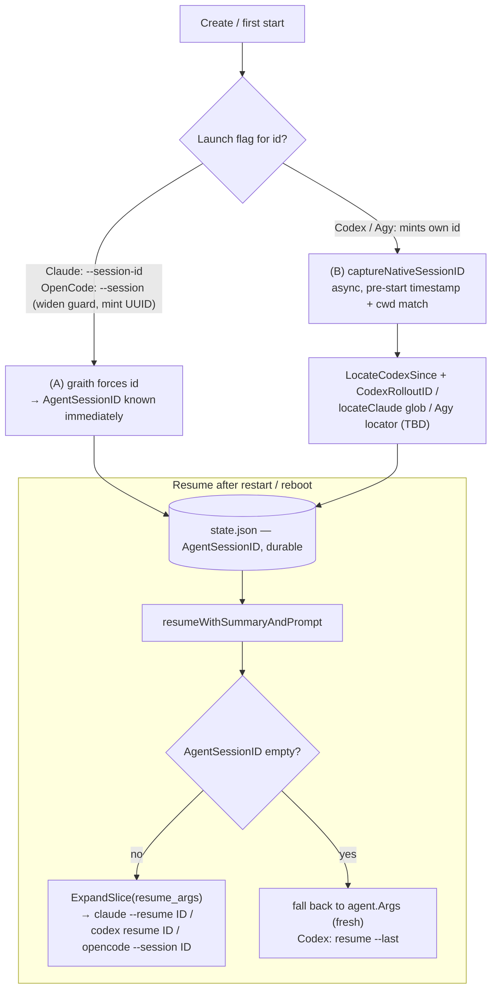

# Agent Conversation Resume

> **Note on code references.** `file:line` citations are anchored to symbol
> names and were written against `main` at the time of writing; absolute line
> numbers drift, so trust the symbol name over the number.

## Background

graith runs each agent (Claude, Codex, Cursor, OpenCode, Agy) in its own PTY
session inside an isolated git worktree. A session is described by
`SessionState` (`internal/daemon/state.go`): `Agent`, `Model`,
`AgentSessionID`, `WorktreePath`, `FreshStart`, etc. State is persisted to
`state.json` and survives daemon restarts and reboots — the worktree, the
branch, and `AgentSessionID` are all durable.

graith already has a notion of "resume". `Resume` → `resumeWithSummary` →
`resumeWithSummaryAndPrompt` (`internal/daemon/daemon.go`) re-launch a stopped
session's agent **in its existing worktree** using the agent's `resume_args`
instead of `args`:

```go
resumeArgs := agent.ResumeArgs
if len(resumeArgs) == 0 || sessFreshStart {
    resumeArgs = agent.Args
}
// ... ExpandSlice(resumeArgs, vars) with vars.AgentSessionID = sessAgentSessionID
```

`resume_args` are templated through `config.ExpandSlice` / `config.Expand`
(`internal/config/template.go`), which already exposes `{agent_session_id}`
(`TemplateVars.AgentSessionID`). So the *plumbing* to pass a native session id
into a resume command already exists end-to-end — what is missing is a reliable
way to **know** each agent's native id.

Each agent's per-command config lives in
`internal/config/default_config.toml`:

| Agent | `args` (first start) | `resume_args` |
|-------|----------------------|---------------|
| `claude` | `["--session-id", "{agent_session_id}"]` | `["--resume", "{agent_session_id}"]` |
| `codex` | `[]` | `["resume", "--last"]` |
| `opencode` | `[]` | `["--session", "{agent_session_id}"]` |
| `cursor` | `[]` | `["resume"]` |
| `agy` | `[]` | `["--conversation", "{agent_session_id}"]` |

**The on-disk transcript is the ground truth for the native id.** Every agent
writes its conversation to disk keyed by *its own* native session id, entirely
independent of graith hooks:

- **Claude Code** — `~/.claude/projects/<sanitized-cwd>/<sessionId>.jsonl`
  (root overridable via `CLAUDE_CONFIG_DIR`). graith locates these **by
  session-id glob**, not path reconstruction, because the dir name replaces
  *all* non-alphanumerics with `-` (`locateClaude`,
  `internal/agent/transcript/claude.go`).
- **Codex** — `~/.codex/sessions/YYYY/MM/DD/rollout-<ts>-<uuid>.jsonl` (root
  overridable via `CODEX_HOME`). The native id is in the first `session_meta`
  line (`CodexRolloutID`, `LocateCodexSince`,
  `internal/agent/transcript/codex.go`).
- **OpenCode / Agy** — write their own transcript/session stores; the on-disk
  layout is not yet reverse-engineered in graith.

graith *also* installs **agent hooks** that shell out to `gr` on lifecycle
events (`internal/daemon/hooks.go`) — but these are **not** an id-capture
channel (see Proposal 2 for why). They exist for status reporting, inbox
checks, and approvals, and only for some agents.

graith already proves the scrape approach works: `captureCodexSessionID`
(`internal/daemon/migrate.go`) polls for the rollout a freshly-started Codex
writes and records its `session_meta` id. **It is currently only called from
`Migrate`**, never from `Create`/`Resume`.

**References:**
[`docs/design/2026-06-24-cross-agent-conversation-migration-design.md`](2026-06-24-cross-agent-conversation-migration-design.md)
(transcript formats, `captureCodexSessionID`, `locate*`, Codex positional-arg
caution);
[`docs/design/2026-06-22-agent-auth.md`](2026-06-22-agent-auth.md).

## Problem

graith "resume" restarts the agent **process** in the existing worktree, but
whether the underlying agent **conversation** is preserved depends entirely on
whether graith knows the agent's native session id. Today that is only reliably
true for Claude.

Per-agent reality, verified against `default_config.toml` and the daemon:

- **Claude — works.** `Create` generates a UUID *only when*
  `agentName == "claude"` and forces it via `--session-id {agent_session_id}`.
  Because the agent is *told* which id to use, graith knows it, and
  `--resume {agent_session_id}` reattaches the exact conversation. The
  transcript under `~/.claude` and the worktree both survive reboots, so Claude
  conversation resume already works across daemon restart and reboot.
- **Codex — fragile.** `args = []` (Codex has no client-supplied-id flag), so
  graith never learns the native id during a normal `Create`. `resume_args =
  ["resume", "--last"]` resumes whatever the *most recent* Codex rollout in the
  cwd is — wrong if anything else ran Codex in that directory, and not pinned to
  this session's conversation. The proven `captureCodexSessionID` scrape exists
  but is **only called from `Migrate`**.
- **OpenCode — broken.** `args = []`, but `resume_args = ["--session",
  "{agent_session_id}"]`. graith never generates an `AgentSessionID` for
  non-Claude agents (the `if agentName == "claude"` guard in `Create`), so
  `{agent_session_id}` expands to **empty** and resume cannot match a real
  conversation.
- **Agy — broken.** Same shape as OpenCode: `args = []`, `resume_args =
  ["--conversation", "{agent_session_id}"]`, id never captured.
- **Cursor — generic.** `resume_args = ["resume"]` resumes the last Cursor
  session for the directory, not an id-pinned conversation.

Specific gaps:

- **No reliable capture of the native session id for agents that mint their
  own.** Claude is the only agent graith *tells* which id to use. For everyone
  else graith must either *force* an id (only possible where a flag exists) or
  *read* the id the agent chose from its on-disk state — and today it does the
  latter only inside `Migrate` (Codex only).
- **`AgentSessionID` is Claude-only.** The field exists for every session in
  `SessionState`, but `Create` populates it only for Claude.
- **Resume commands reference an id that was never captured.** OpenCode/Agy
  `resume_args` template `{agent_session_id}` against an empty value.
- **No durable, per-agent strategy.** There is no single place that says, per
  agent type, *how* the native id is obtained and *how* resume reconstructs the
  command from it.

## Goals

1. After a daemon restart or machine reboot, resuming a stopped session
   reattaches the **same native agent conversation**, not a fresh one, for every
   agent that supports conversation resume.
2. Capture and persist each session's **native agent session id** in
   `SessionState.AgentSessionID`, via a mechanism that does **not** depend on
   agent hooks (which don't fire for the broken agents).
3. Reconstruct the per-agent resume command from the id via the **existing**
   `resume_args` + `{agent_session_id}` templating — no new command-building
   machinery.
4. Degrade gracefully: an agent with no resume support, or a session whose id
   was never captured, must still start (fresh) rather than fail.
5. Require **no changes to the agents themselves** — only graith forcing an id
   where a launch flag exists, and graith reading the agents' own state dirs.

### Non-Goals

- Cross-agent resume (resuming a Claude conversation under Codex). That is
  conversation *migration*, already covered by `gr migrate`.
- Reconstructing a conversation graith never captured an id for (e.g. a session
  created before this feature shipped — see Migration).
- Faithful transcript transplant or replay. We resume the agent's *own* native
  conversation by id; we do not parse or re-inject transcript content.
- Resuming agents that genuinely have no resume capability (we detect and report
  this, we do not emulate it).

## Proposals

### Proposal 0: Do Nothing

Keep today's behavior: Claude resumes its conversation; Codex resumes
`--last` (cwd-scoped, fragile); OpenCode/Agy resume against an empty id (a
fresh/broken conversation); Cursor resumes the last cwd session.

- **Pros:** zero work; Claude (the most-used agent) already works.
- **Cons:** the headline feature ("resume the conversation, not just the
  process") is false for every non-Claude agent. OpenCode/Agy resume is
  actively broken. Codex resume silently grabs the wrong conversation when
  multiple Codex runs share a cwd.

### Proposal 1: Force-Where-Supported + State-Dir Scrape Foundation (Recommended)

Two complementary, **hook-independent** mechanisms, applied per agent by
capability:

- **(A) Force the id at launch where a launch flag exists** — zero capture,
  fully deterministic. Claude already does this (`--session-id`); extend to
  OpenCode (`--session <uuid>`) by having graith mint the UUID.
- **(B) Read the native id from the agent's on-disk state dir** — the *ground
  truth*, hook-independent — for agents that mint their own id and have no
  launch flag (Codex; Agy once its format is known). This generalizes the proven
  `captureCodexSessionID` and is the **foundation, not a fallback**.

Resume then flows through the existing `resume_args` + `{agent_session_id}`
templating unchanged.



#### 1. (A) Force the id where a launch flag exists

Claude already mints a UUID and passes `--session-id {agent_session_id}` in
`Create`. Extend the same pattern to OpenCode:

- **Widen the Claude-only mint guard — in *all* mint sites, not just `Create`.**
  The `if agentName == "claude"` UUID block is duplicated across **four** places:
  `Create` (`daemon.go`, `agentSessionID` block), `Fork` (`daemon.go`,
  identical inline block), orchestrator create/restart (`orchestrator.go`), and
  `Migrate`'s target-agent assignment (`migrate.go`). Widening only `Create`
  reintroduces the empty-`--session` bug for **forked, orchestrator, and
  migrated-to-OpenCode** sessions. Recommended: first refactor the three inline
  `rand`/`Sprintf` blocks into the existing `newAgentSessionID()` helper
  (`migrate.go`) plus a single `forcesID(agent)` predicate, so "widen the guard"
  becomes a one-line change in one place.
- Set `opencode.args = ["--session", "{agent_session_id}"]` so first start and
  resume reference the **same** id.

**GATING VERIFICATION (two distinct failure modes):**
1. confirm OpenCode's `--session` accepts a *brand-new* id at first start
   (creating a conversation under that id), not only resume of an existing one;
2. confirm it accepts an id in **graith's UUID format** at all — OpenCode's
   native ids are *not* UUIDs (they use a prefixed opaque form, e.g. `ses_…`),
   so `--session <uuid>` may be rejected or create a malformed session even if
   `--session` does accept new ids.

If either check fails, OpenCode cannot be forced and **drops to mechanism (B)**
(or stays broken until its on-disk format is reverse-engineered). These are
gating tests, not follow-ups.

Codex, Cursor, and Agy have **no** client-supplied-id launch flag, so (A) does
not apply to them — they use (B).

#### 2. (B) Read the native id from the agent's state dir (foundation)

Generalize `captureCodexSessionID` (`internal/daemon/migrate.go`) into
`captureNativeSessionID(id, agent, worktreePath, since, stateRoot)` and **call
it from `Create`, `Fork`, and `resumeWithSummaryAndPrompt`** (not just
`Migrate`) for agents that mint their own id:

- **Codex:** `LocateCodexSince(worktreePath, since)` + `CodexRolloutID(path)`
  (already implemented and used by migrate). Records the rollout's
  `session_meta` id into `AgentSessionID`. (The reader scans the first ~5 lines
  for a `session_meta` record, not strictly the first line.)
- **Agy:** add a locator mirroring the Codex one. The default sandbox config
  (`agents.agy.sandbox.read_dirs = ["~/.gemini"]`) strongly implies Agy is a
  Gemini-CLI derivative writing under `~/.gemini` — that is the concrete
  starting point, not fully TBD. Until the format and the validity of
  `--conversation <id>` are verified, mark Agy resume support **unknown** (not
  "broken with known fix") and resume fresh (Goal 4).
- **Claude (defensive only):** the id is forced, so capture is unnecessary; the
  `locateClaude` glob exists if a consistency check is ever wanted.

The scrape is **best-effort and bounded** (the existing helper polls
12×250 ms, then gives up with a `Warn`), runs in a goroutine so it never blocks
start, and uses a **pre-start timestamp** (`since`).

**Correctness requirements the generalization must add (raised by review):**

- **Stale-safe, *not* race-safe.** `LocateCodexSince` filters by `mtime ≥ since`
  and `cwd == worktree`, which defeats *stale* rollouts but **not** concurrent
  sessions sharing one cwd. graith allows that via `--share-worktree` and
  `--in-place --allow-concurrent`: two Codex starts in the same cwd within the
  ~3 s window both match and both pick newest-by-mtime, so they can **cross-
  assign or duplicate ids**. Either gate the scrape off for shared/in-place-
  concurrent Codex (fall back to `resume --last`) or add a tighter discriminator
  (e.g. a graith-injected marker in the first turn). Consider a small grace
  (`since - 2s`) to avoid an mtime fencepost miss on coarse filesystems.
- **State root must come from the session's effective agent env, not the
  daemon's.** `codexHome()`/`claudeConfigDir()` read `os.Getenv` *in the daemon
  process*, but `CODEX_HOME`/`CLAUDE_CONFIG_DIR` can be set per-agent via
  `[agents.<name>.env]`, which only affects the *spawned agent*. If they
  diverge, the agent writes one root and the daemon scrapes another →
  capture silently times out. Thread the resolved `stateRoot` (derived from the
  session's launch env) into the locators; if a custom root is set, ensure it is
  also in the sandbox `write_dirs` or emit a config warning. (Latent in the
  existing migrate path; the generalization makes it load-bearing.)
- **Never clobber a good id.** `captureCodexSessionID` currently overwrites
  `AgentSessionID` unconditionally (`migrate.go`). The generalized helper must
  capture only when `AgentSessionID == ""` (or the scraped id equals the stored
  one), and carry a **generation check** (expected PID / process start time) so
  a stale goroutine from an earlier start cannot overwrite a later one. Warn on
  conflict; do not silently replace.
- **Sandbox does *not* block the scrape.** Capture runs in the unsandboxed
  daemon, so the agent's `read_dirs` policy is irrelevant to capture — the only
  sandbox concern is the agent being able to *write* its transcript (covered by
  the default `write_dirs`, except for the custom-`CODEX_HOME` case above).

#### 3. Resume reconstruction (no new machinery)

Once `AgentSessionID` is populated by (A) or (B),
`resumeWithSummaryAndPrompt` already builds `vars.AgentSessionID =
sessAgentSessionID` and runs `ExpandSlice(resumeArgs, vars)`. Config changes:

```toml
[agents.codex]
resume_args = ["resume", "{agent_session_id}"]   # was ["resume", "--last"]

[agents.opencode]
args        = ["--session", "{agent_session_id}"] # NEW — paired with guard widening
resume_args = ["--session", "{agent_session_id}"] # id now real (forced)

[agents.agy]
resume_args = ["--conversation", "{agent_session_id}"] # id from scrape when format known
```

Codex `resume <id>` is the id-pinned form (vs `resume --last`); the positional
`[SESSION_ID]` is confirmed present in `codex-cli 0.142.2`
(`codex resume [OPTIONS] [SESSION_ID] [PROMPT]`). As the cross-agent-migration
doc cautioned about Codex's *positional prompt*, a positional `<id>` is easy to
get subtly wrong. **Verifying that `codex resume <id>` actually reattaches by id
(not merely behaves like `resume --last`) is a gating test** (see Tests). The
empty-id safety net below is the fallback if it fails.

Note: the Codex-specific `resume --last` fallback (below) means the resume path
keeps one agent-specific branch (`if agent == "codex"`), a small, deliberate
exception to Goal 3's "no new command-building machinery" — everything else
stays in config.

#### 4. Safety nets and edge cases

- **Agent with no resume support.** Empty `resume_args` ⇒
  `resumeWithSummaryAndPrompt` already falls back to `agent.Args` (fresh start).
- **Empty / missing id at resume — this guard does NOT exist yet; it is new
  code.** `ExpandSlice` expands `{agent_session_id}` to `""` *without error*
  (the key is always present in `toMap()`), so today `opencode --session ""` /
  `agy --conversation ""` ship literally. The guard must inspect the **raw
  `agent.ResumeArgs` *before* expansion** — after `ExpandSlice` the
  `{agent_session_id}` token is already gone, so a post-expansion check can't
  tell "expanded to empty" from "always empty". Sketch:
  ```go
  needsID := slices.ContainsFunc(agent.ResumeArgs,
      func(s string) bool { return strings.Contains(s, "{agent_session_id}") })
  if needsID && sessAgentSessionID == "" {
      // codex: use ["resume", "--last"]; others: fall back to agent.Args
  }
  ```
  Log `"no native id captured; starting fresh"`. **Codex exception:** fall back
  to `resume --last` (today's behavior), not `agent.Args` (which is empty for
  Codex).
- **Id captured but conversation gone** (transcript deleted, `CODEX_HOME`
  changed, state dir on a tmpfs wiped by reboot, machine migrated). Optional
  hardening: reuse `locate*` to verify the transcript exists before resume, else
  fresh start with a warning (Future). Note this also covers
  **captured-id-but-resume-flags-changed**: an agent upgrade that alters the
  `resume <id>` CLI surface produces a hard failure or silent fresh start that
  the *empty*-id guard never catches — only the (deferred) verify-before-resume
  probe would.
- **Fork.** *(Corrected — earlier draft mis-stated this.)* `Fork` does **not**
  set `FreshStart`, and `ForkSourceAgentSessionID` is **not** a persisted
  `SessionState` field — it exists only transiently in `TemplateVars` to expand
  `fork_args`. Fork starts immediately using `fork_args` (or `args`), and mints
  a new id only for Claude. For self-minting agents (Codex/Agy) the forked child
  gets a fresh native id Fork never captures, so **(B) must run after the fork
  start** — same as `Create`. (Forked Codex is broken today for exactly this
  reason: `fork_args = ["fork", "{fork_source_agent_session_id}"]` makes Codex
  mint a new id that is never captured.)
- **Cursor.** Proposal 1 does nothing for Cursor (no force flag; left on generic
  `resume`, which has the same multi-session-same-cwd fragility condemned for
  Codex `--last`). Cursor is the **one agent where a hook could legitimately
  beat scraping** — it already fires a `sessionStart` hook and has a known
  project-dir encoding (`cursorProjectKey`, `hooks.go`). Treat Cursor as
  explicit Future: either a `~/.cursor/projects/<key>` locator or a
  Cursor-`sessionStart`-hook capture (the narrow hook exception — see
  Proposal 2).

- **Pros:** hook-independent — works for OpenCode/Agy, which never fire hooks
  and may run with `AgentHooks == false`; (A) is zero-capture and fully
  deterministic; (B) reuses the proven `captureCodexSessionID` pattern and the
  agent's own on-disk truth; resume reuses existing `{agent_session_id}`
  templating; Claude unaffected.
- **Cons:** (B) must reverse-engineer each minting agent's on-disk layout and
  track version drift; Agy support is blocked on that reverse-engineering;
  (A) for OpenCode is gated on `--session` accepting a brand-new id; scrape is
  inherently best-effort and racy for agents that write the id lazily.

**Future:** verify-before-resume (probe the transcript exists, else fresh
start); surface capture **provenance/status** (forced vs scrape vs migrate) in
`gr list` — note `AgentSessionID` *itself* is **already** in `SessionInfo` /
`toSessionInfo`, so only provenance + display/redaction is new; add the Agy and
Cursor locators once their formats are confirmed.

### Proposal 2: Hook-Capture the Native Session ID (Rejected)

Extend the existing hook path (`gr report-status` on `SessionStart`,
`internal/daemon/hooks.go`) to carry the agent's native id in the hook stdin
payload, parse it in `report-status`, and persist it in `HandleHookReport`.

**Rejected — verified against the code, hooks are not a reliable id channel:**

1. **`report-status` carries graith's *own* id, not the agent's native id.**
   Its `hookStdin` struct parses only `tool_name` / `notification_type`
   (`internal/cli/report_status.go`), and the `SessionID` it sends is
   `os.Getenv("GRAITH_SESSION_ID")` — graith identity, zero native-agent-id
   information. (An earlier draft of this doc wrongly called this "~90% built";
   it is not.)
2. **Hooks never fire for the broken agents.** `injectHooks`
   (`internal/daemon/hooks.go`) dispatches only `claude`/`codex`/`cursor`;
   the `default` case installs nothing. **OpenCode and Agy — the exact agents
   whose resume is broken — never fire a hook**, so a hook-primary design can
   never capture their id. Hooks are also opt-in (`AgentHooks` flag).

- **Pros:** would reuse already-installed hook files for the agents that do have
  them; could give a "conversation started" signal.
- **Cons:** structurally cannot cover OpenCode/Agy; redundant for Claude (id
  forced); for Codex the scrape is already proven and hook-independent. Building
  id capture on hooks adds protocol surface (`StatusReportMsg.AgentSessionID`,
  `hookStdin` keys) for no reliability gain. **Hooks stay scoped to their real
  job — status, inbox, approvals — and are dropped from the id-capture path *as
  the primary/general channel*.**

**Scope of the rejection (narrowed after review).** This rejects hooks as the
*primary/general* id channel — not as *never* the right channel. One genuine
exception: **Cursor** fires a `sessionStart` hook, has no force-id flag, and
would otherwise need `~/.cursor/projects/` reverse-engineering — so *if* the
Cursor `sessionStart` payload carries a native id, a hook is a cleaner capture
than a scrape (no glob, no mtime race, fires once). That is a considered
alternative for Cursor specifically (see §4 Cursor / Future), not a reversal of
the recommendation. For Claude/Cursor a hook could also serve as a defensive
*consistency check* against the scraped/forced id. None of this changes the
foundation: hooks can never capture OpenCode/Agy.

### Proposal 3: Force a client-supplied id for *every* agent (Rejected)

Mirror the Claude approach for all agents — pass `--session-id`/equivalent at
first start so graith always *chooses* the id.

- **Pros:** if it worked, graith would always know the id with zero capture.
- **Cons:** **only Claude and OpenCode support a client-supplied conversation id
  at launch.** Codex/Cursor/Agy mint their own and have no such flag, so this
  cannot be the general mechanism — those agents *must* use the state-dir scrape
  (Proposal 1B). Force-where-supported (1A) already captures the only two cases
  where forcing is possible.

## Other Notes

### References

- `internal/daemon/daemon.go` — `Create` and `Fork` (Claude-only
  `AgentSessionID` gen, `if agentName == "claude"` — two of four mint sites to
  widen for OpenCode), `resumeWithSummaryAndPrompt` (`resumeArgs` selection +
  `ExpandSlice`; the empty-id guard is **new**, not present today).
- `internal/daemon/migrate.go` — `captureCodexSessionID` (generalize →
  `captureNativeSessionID`), `newAgentSessionID`.
- `internal/agent/transcript/codex.go` — `LocateCodexSince`, `CodexRolloutID`;
  `internal/agent/transcript/claude.go` — `locateClaude` (session-id glob).
- `internal/config/template.go` — `TemplateVars.AgentSessionID`,
  `{agent_session_id}` (already wired; no change).
- `internal/config/default_config.toml` — per-agent `args`/`resume_args`.
- `internal/daemon/state.go` — `SessionState.AgentSessionID` (durable),
  `FreshStart`; `Reconcile` marks dead-running sessions stopped on daemon start
  while preserving `AgentSessionID`.
- `internal/daemon/orchestrator.go` — a *third/fourth* Claude-only mint site
  (orchestrator create/restart) the guard-widening must also cover.
- `internal/daemon/handler.go` — `toSessionInfo` already maps `AgentSessionID`
  into `protocol.SessionInfo` (so it is *not* future work).
- `internal/cli/daemon.go` / `internal/daemon/upgrade.go` — `gr daemon restart`
  **preserves** live sessions via exec/adoption (agent process not relaunched);
  native resume is only exercised on `--force`/clean stop-start, crash, or
  reboot. Tests must use one of those.
- `internal/daemon/hooks.go` — `injectHooks` dispatch (claude/codex/cursor only;
  evidence hooks can't be the id channel); `injectCursorHooks` + `cursorProjectKey`
  (the Cursor hook/locator exception); `internal/cli/report_status.go` —
  `hookStdin`, `SessionID = os.Getenv("GRAITH_SESSION_ID")` (same evidence).
- cmux (`~/Code/manaflow-ai/cmux`) — prior art that uses **hooks** to capture
  the id (`SessionStart` → `cmux hooks <agent> session-start`,
  `extractClaudeHookSessionId`, persisted to
  `~/.cmuxterm/<agent>-hook-sessions.json`). graith deliberately diverges:
  graith's hooks don't fire for all agents and carry graith identity, so graith
  uses force + state-dir scrape instead. The *resume-command reconstruction* is
  the same idea (`claude --resume <id>`, `codex resume <id>`,
  `opencode --session <id>`, `agy --conversation <id>`).
- [Codex CLI command-line reference](https://developers.openai.com/codex/cli/reference)
  — `codex resume <id>` vs `resume --last`.

### Alternatives considered

- **Hook-capture (Proposal 2):** rejected *as the primary/general channel* —
  hooks carry graith's id, not the agent's native id, and never fire for
  OpenCode/Agy (the broken agents). **Narrow exception kept open:** Cursor (and a
  Claude/Cursor consistency check) — see Proposal 2's scope note.
- **Universal force-id (Proposal 3):** rejected — only Claude/OpenCode have a
  client-supplied-id launch flag.
- **Persist captured ids in a side file** (cmux's
  `~/.cmuxterm/<agent>-hook-sessions.json`): rejected — graith already has a
  durable per-session `AgentSessionID` field and a `saveState()` path; a
  parallel store would duplicate truth and complicate `state.go` reconcile.
- **PTY scrollback scraping** (`internal/pty/scrollback.go`): source-agnostic
  but extremely lossy and fragile to TUI redraws; not a reliable id source.
- **Verify-before-resume on every resume:** deferred to Future — adds a
  stat/glob per resume; the empty-id guard covers the common failure mode.

### Implementation Notes

| File | Change |
|------|--------|
| `internal/daemon/daemon.go` + `orchestrator.go` + `migrate.go` | Refactor the **four** inline Claude-only UUID mint sites (`Create`, `Fork`, orchestrator create/restart, `Migrate` target assignment) into one `newAgentSessionID()` + `forcesID(agent)` predicate, then widen to `opencode` — so all of Create/Fork/orchestrator/migrate force the id (gated on the OpenCode new-id **and** id-format verification) |
| `internal/daemon/daemon.go` | Generalize `captureCodexSessionID` → `captureNativeSessionID(id, agent, worktreePath, since, stateRoot)`; call from `Create`/`Fork`/`resumeWithSummaryAndPrompt`; **capture only when id empty**; add a **generation check** (expected PID/start-time) so a stale goroutine can't clobber a later start |
| `internal/daemon/daemon.go` | `resumeWithSummaryAndPrompt`: empty-id guard that inspects **raw `agent.ResumeArgs` before `ExpandSlice`** → fall back to `agent.Args` (Codex: `resume --last`) with a log line |
| `internal/agent/transcript/codex.go` / `claude.go` | Make locators accept an explicit `stateRoot` (from the session's **effective agent env**, not daemon `os.Getenv`) so `CODEX_HOME`/`CLAUDE_CONFIG_DIR` overrides are honored; consider an `mtime - grace` window; ambiguous multi-match → leave empty + warn (don't pick newest) |
| `internal/agent/transcript/` | Add an Agy locator (start at `~/.gemini`, per the sandbox hint) and a Cursor locator (`~/.cursor/projects/<cursorProjectKey>`) once formats are confirmed |
| `internal/config/default_config.toml` | `codex.resume_args = ["resume", "{agent_session_id}"]` **only after** the empty-id guard lands (else best-effort `--last` regresses to `resume ""`); `opencode.args = ["--session", "{agent_session_id}"]` (paired with guard widening + gating); if a custom `CODEX_HOME`/`CLAUDE_CONFIG_DIR` is set, ensure it is also in sandbox `write_dirs` |
| `internal/daemon/state.go` | Record capture **provenance/status** (forced/scrape/migrate) — `AgentSessionID` is *already* in `SessionInfo`; bump `CurrentStateVersion` + no-op migrator if a field is added |
| ~~`internal/cli/report_status.go` / `internal/protocol/messages.go`~~ | **No change** — id capture is deliberately *not* built on hooks (Proposal 2); Cursor-hook capture is a separate Future item |
| `docs/` / `CLAUDE.md` | Document per-agent resume support + capture mechanism (force vs scrape); note shared/in-place-concurrent Codex is best-effort/unsupported for id-pinning |

**Migration:** sessions created before this feature have no captured id for
non-Claude agents. On first resume they fall through the empty-id guard and
start fresh (Codex: `--last`) — no `state.json` schema bump required since
`AgentSessionID` already exists; it is simply populated going forward. If
provenance is added to `SessionState`, bump `CurrentStateVersion` with a no-op
`migrateVNToVN+1` per the `state.go` convention.

**Tests:**

| File | Change |
|------|--------|
| `internal/config/template_test.go` | `{agent_session_id}` expands to `""` (no error) when empty (`neep`) — the fact that *forces* the empty-id guard |
| `internal/daemon/daemon_test.go` | `Create`/`Fork`/orchestrator all mint `AgentSessionID` for `opencode` (`braw`) and force `--session`; non-forceable agents (`thrawn` codex) leave it empty until scrape; resume of a `bide` codex session uses the captured id; empty-id resume inspects raw args and falls back to `agent.Args` (`dreich`), Codex empty-id falls back to `resume --last` (`haar`); capture **does not overwrite** a non-empty id (`bonnie`); a stale-generation capture goroutine cannot clobber a later start (`auld`) |
| `internal/daemon/migrate_test.go` | generalized `captureNativeSessionID` for codex matches only files since `since` (`canny` race), times out cleanly (`fash`), and on **two same-cwd matches** refuses to guess (`haar`); honors `CODEX_HOME` set via `agents.codex.env`, not just daemon env (`glen`) |
| `internal/config/config_test.go` | `codex.resume_args`/`opencode.args` expand `{agent_session_id}` to the captured id (`kirk`); empty id yields the documented fallback (`neep`) |
| `internal/integration/integration_test.go` | **GATING — Codex id-pinning:** create `braw` codex → capture id → start a *second* unrelated codex run in the same cwd → **clean-restart the daemon (`gr daemon restart --force`, not the default which preserves sessions)** → resume must reattach the **`braw` id's** conversation, proving `codex resume <id>` ≠ `resume --last`. **GATING — OpenCode:** confirm `opencode --session <brand-new-uuid>` *creates* a conversation at first start AND accepts graith's UUID **format** (not only `ses_…`); then create → stop → restart → resume reattaches the same id. **Shared-worktree race:** two same-cwd Codex sessions (`--share-worktree`/`--in-place --allow-concurrent`) must each get their *own* id or fall back — never cross-assign (`thrawn`). Agent with empty `resume_args` (`neep`) starts fresh without error |

Per repo convention, test fixture strings use old Scots words (e.g. `braw`,
`bide`, `thrawn`, `dreich`, `canny`, `fash`, `kirk`, `haar`, `neep`, `bonnie`,
`auld`, `glen`).
