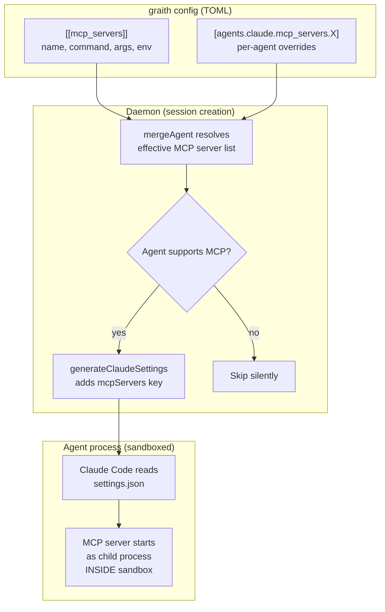
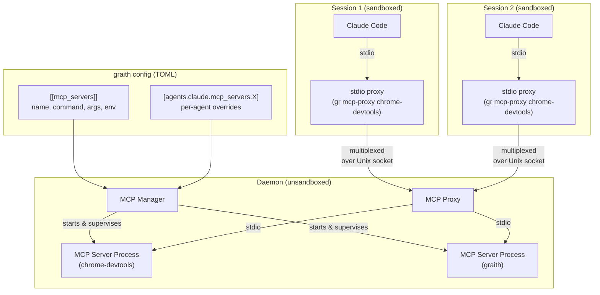

# Design Doc: MCP Server Injection

## Background

graith manages AI coding agent sessions in isolated git worktrees. It already injects lifecycle hooks into agents at session creation — Claude Code gets a `settings.json` with hooks via `--settings`, Codex gets shell scripts via `CODEX_HOOKS_DIR`. This infrastructure is in `internal/daemon/hooks.go`.

The [Model Context Protocol (MCP)](https://modelcontextprotocol.io/) is a standard for connecting AI agents to external tools. graith itself already runs as an MCP server (`gr mcp`) exposing session management tools. Claude Code supports MCP servers via its `settings.json` `mcpServers` key.

- **Parent issue:** [d0ugal/graith#359](https://github.com/d0ugal/graith/issues/359)
- **Motivating use case:** Chrome DevTools MCP crashes inside graith's macOS Seatbelt sandbox due to Chrome's inner sandbox re-init. The workaround is to run Chrome externally and point `chrome-devtools-mcp` at it via `--browserUrl`. This needs a general way to manage MCP servers and proxy them into agent sessions.

## Problem

Agents running inside graith have no access to MCP servers unless the user manually configures them in each agent's own settings. This creates several problems:

- **Sandbox conflicts:** MCP servers that launch sub-processes (Chrome, Playwright) crash inside the Seatbelt sandbox. Users must run these externally and manually wire up connection URLs.
- **Per-agent configuration burden:** Each agent type has its own config format for MCP servers. Users must duplicate MCP server definitions across `~/.claude/settings.json`, Codex config, etc.
- **No central management:** graith manages agent lifecycle but not their tool ecosystem. Adding a new MCP server to all sessions requires editing multiple agent configs manually.
- **Resource waste:** Each agent session launches its own instance of every MCP server. Five sessions using chrome-devtools means five separate MCP server processes, five `npx` downloads, five Chrome connections.
- **graith's own MCP server is invisible:** `gr mcp` exposes session management tools (list, create, publish messages), but agents don't know about it unless manually configured.

## Goals

1. Users declare MCP servers in graith's TOML config. The **daemon starts and supervises** these MCP server processes.
2. MCP server processes are **shared across all agent sessions** that use them — one chrome-devtools-mcp process serves all sessions.
3. The daemon **proxies MCP connections** into agent sessions via stdio, so agents see a local MCP server regardless of where the real process runs.
4. MCP servers run **outside the agent sandbox**, solving the sandbox conflict problem entirely.
5. graith's own MCP server (`gr mcp`) is auto-injected into all supporting agents by default.
6. MCP server config supports global and per-agent scoping (enable/disable per agent).
7. Config changes take effect on daemon reload — no need to recreate sessions.

### Non-Goals

- **Running MCP servers on remote hosts.** The daemon manages local processes only. Network-based MCP proxying is out of scope.
- **Supporting agents that lack MCP support.** Codex, Agy, and OpenCode do not currently support MCP. When they do, proxy injection handlers will be added. Until then, MCP servers configured globally are silently skipped for unsupported agents.

## Proposals

### Proposal 0: Do nothing

Users continue to manually configure MCP servers in each agent's native config. Chrome DevTools MCP remains unusable inside sandboxed sessions without manual workarounds. graith's own MCP server stays invisible to agents.

### Proposal 1: Config injection only (implemented in v0.22.0)

This was the initial implementation shipped in v0.22.0. Declare MCP servers in graith's TOML config; at session creation, inject the raw command/args into the agent's settings so the **agent launches MCP servers as its own child processes**.

**How it works today:**



#### Limitations

- **MCP servers run inside the sandbox** — Chrome DevTools MCP can't launch Chrome, Playwright can't launch browsers, etc.
- **One MCP server per session** — five sessions = five chrome-devtools-mcp processes, five `npx` downloads.
- **No hot-reload** — config changes require session restart to take effect.
- **Agent manages MCP lifecycle** — if the MCP server crashes, only the agent can restart it. graith has no visibility.

This proposal serves as the stepping stone to Proposal 2.

### Proposal 2: Daemon-managed MCP servers with proxy (recommended)

The daemon starts MCP server processes itself, outside any sandbox, and **proxies MCP connections** into agent sessions via stdio. One MCP server process is shared across all sessions that use it.

**Architecture diagram:**



#### How it works

1. **Daemon reads config** and starts each declared MCP server as a child process, communicating via stdio (JSON-RPC, per the MCP spec).
2. **MCP Manager** in the daemon supervises these processes — restarts on crash, stops on config removal, starts new ones on config addition.
3. **Agent sessions get a proxy command** instead of the raw MCP server command. In Claude Code's settings.json:
   ```json
   {
     "mcpServers": {
       "chrome-devtools": {
         "command": "/opt/homebrew/bin/gr",
         "args": ["mcp-proxy", "chrome-devtools"]
       }
     }
   }
   ```
4. **`gr mcp-proxy <name>`** is a lightweight stdio-to-Unix-socket bridge. Claude Code launches it as a child process (inside the sandbox). It connects to the daemon over the existing Unix socket and requests a multiplexed channel to the named MCP server. The daemon forwards JSON-RPC messages between the proxy and the real MCP server process.
5. **Multiple sessions share one MCP server** — the daemon multiplexes. Each proxy gets an independent JSON-RPC session (MCP servers are stateless per-request for tool calls, so this is straightforward).

#### Config format

Same TOML format as Proposal 1, with one addition — an optional `sandbox` boolean:

```toml
[[mcp_servers]]
name = "chrome-devtools"
command = "npx"
args = ["@anthropic-ai/chrome-devtools-mcp@latest"]
sandbox = false  # needs to launch Chrome, can't be sandboxed

[[mcp_servers]]
name = "graith"
command = "gr"
args = ["mcp"]
# sandbox defaults to true — most MCP servers work fine sandboxed
```

The `sandbox` field controls whether the daemon wraps the MCP server process with safehouse. When `true` (the default), the daemon uses the global sandbox config (features, read_dirs, write_dirs) as the base, plus any MCP-server-specific overrides. When `false`, the MCP server runs unsandboxed as a direct child of the daemon.

Default is `true` because most MCP servers work fine in the sandbox — they typically just need network access and read access to a few paths. The user opts out per server for cases like Chrome DevTools where the MCP server needs to launch sub-processes that conflict with the sandbox.

Example with sandbox enabled and server-specific overrides:

```toml
[[mcp_servers]]
name = "filesystem-tools"
command = "npx"
args = ["@anthropic-ai/filesystem-mcp@latest"]
sandbox = true

[mcp_servers.sandbox_config]
read_dirs = ["~/Documents"]
write_dirs = ["~/Documents"]
```

The `sandbox_config` table is optional and follows the same schema as the global `[sandbox]` section. When present, it is merged with the global sandbox config (same merge semantics as agent sandbox — server-specific dirs are appended, server-specific features are appended). When absent, the global sandbox config is used as-is.

Per-agent overrides:

```toml
# Disable chrome-devtools for codex
[agents.codex.mcp_servers.chrome-devtools]
disabled = true
```

No other config format changes needed — the difference is entirely in how the daemon uses the config.

#### Auto-injection of graith MCP server

graith's own MCP server (`gr mcp`) is always injected, even if not declared in config. Since the daemon manages the process, `gr mcp` runs with full access to the daemon's state — no need for the `GRAITH_SESSION_ID` env var hack. The proxy command carries the session context:

```
gr mcp-proxy graith --session <session-id>
```

Users can disable auto-injection per-agent or globally:

```toml
[agents.claude.mcp_servers.graith]
disabled = true
```

#### Proxy protocol

The proxy uses the existing graith Unix socket and framed binary protocol. A new control message type requests an MCP channel:

```json
{"type": "mcp_connect", "payload": {"server": "chrome-devtools", "session_id": "abc123"}}
```

The daemon responds with a channel ID. Subsequent frames on that channel carry raw JSON-RPC bytes between the proxy and the MCP server. The proxy's job is trivial: read stdin → frame and send to daemon → read frames from daemon → write to stdout.

#### MCP server lifecycle

| Event | Behavior |
|-------|----------|
| Daemon starts | Start all enabled MCP servers from config |
| Config reload (`gr daemon reload`) | Start new servers, stop removed ones, restart changed ones |
| MCP server crashes | Restart with exponential backoff (1s, 2s, 4s, ... max 60s) |
| Daemon stops | Send SIGTERM to all MCP server processes, wait 5s, SIGKILL |
| Session created | Inject `gr mcp-proxy <name>` for each enabled MCP server |
| Session resumed | Same injection — proxy reconnects to daemon |
| All sessions using a server deleted | Server keeps running (config-driven, not session-driven) |

#### Injection mechanism — Claude Code

`generateClaudeSettings()` injects proxy commands instead of raw MCP server commands:

```json
{
  "hooks": { ... },
  "mcpServers": {
    "graith": {
      "command": "/opt/homebrew/bin/gr",
      "args": ["mcp-proxy", "graith", "--session", "abc123"]
    },
    "chrome-devtools": {
      "command": "/opt/homebrew/bin/gr",
      "args": ["mcp-proxy", "chrome-devtools"]
    }
  }
}
```

Claude Code launches `gr mcp-proxy` as a child process (inside the sandbox — it only needs access to the Unix socket). The proxy connects to the daemon, which forwards to the real MCP server running outside the sandbox.

#### Injection mechanism — other agents

Same proxy command, different injection format per agent:

| Agent    | MCP support | Injection mechanism | Proxy command |
|----------|-------------|---------------------|---------------|
| Claude   | Yes | `--settings` flag | `gr mcp-proxy <name>` |
| Codex    | Yes | `--profile graith` flag | `gr mcp-proxy <name>` |
| Agy      | Yes | `.gemini/settings.json` | `gr mcp-proxy <name>` |
| OpenCode | Yes | `OPENCODE_CONFIG_CONTENT` env var | `gr mcp-proxy <name>` |

All agents get the same proxy binary — only the injection format differs.

#### Sandbox interaction

MCP servers run as daemon child processes, **outside the agent sandbox** by default. This solves the core problem: Chrome DevTools MCP can launch Chrome, Playwright can launch browsers, etc. The only thing inside the agent sandbox is `gr mcp-proxy`, which needs read access to the Unix socket.

However, MCP servers can optionally be sandboxed independently via `sandbox = true` in their config. This is useful for MCP servers that don't need elevated privileges — sandboxing them limits blast radius if the server is compromised or misbehaves. The daemon wraps the MCP server command with `safehouse wrap`, using the global sandbox config as the base plus any server-specific `sandbox_config` overrides.

The sandbox config already grants access to the graith data dir (where the Unix socket lives), so no additional sandbox configuration is needed for the proxy.

**Sandbox decision tree for MCP servers:**

| Server needs | `sandbox` setting | Rationale |
|---|---|---|
| Typical MCP server (filesystem, search, etc.) | `true` (default) | Works fine sandboxed |
| Network access to external services | `true` with features | Add `"network"` feature if needed |
| Read/write to specific directories only | `true` with `sandbox_config` | Principle of least privilege |
| Launch sub-processes (Chrome, browsers) | `false` | Sub-process sandbox re-init crashes |
| Full system access (e.g., graith MCP) | `false` | Needs daemon state, Unix socket, etc. |

#### Chrome DevTools use case

With daemon-managed MCP servers, the Chrome DevTools workflow becomes:

1. User adds to graith config:
   ```toml
   [[mcp_servers]]
   name = "chrome-devtools"
   command = "npx"
   args = ["@anthropic-ai/chrome-devtools-mcp@latest"]
   ```
2. Daemon starts chrome-devtools-mcp, which launches Chrome automatically (outside the sandbox).
3. All sessions automatically get chrome-devtools via proxy — agents can navigate pages, take screenshots, run Lighthouse audits, etc.
4. One Chrome instance, one MCP server process, shared across all sessions.
5. No `--browserUrl` workaround needed. No sandbox conflicts.

#### Hot-reload

When the user changes MCP server config and runs `gr daemon reload` (or the daemon detects config changes):

1. New servers are started immediately.
2. Removed servers are stopped (existing proxy connections get an error, agents handle gracefully).
3. Changed servers (command/args/env differ) are restarted. Existing proxy connections are terminated and agents reconnect via a new proxy.
4. **No session restart needed** — the next time an agent calls an MCP tool, the proxy connects to the updated server.

#### Multiplexing considerations

MCP uses JSON-RPC over stdio. Each tool call is a request/response pair. The daemon needs to route responses back to the correct proxy (and thus the correct session).

Options:
- **Per-session MCP connections:** The daemon maintains one stdio connection to the MCP server per active proxy. Simple, but means N connections for N sessions. MCP servers are typically lightweight, so this is fine for small N.
- **True multiplexing:** The daemon maintains one connection to the MCP server and routes JSON-RPC requests/responses by `id`. More efficient for large N, but requires tracking request IDs across sessions.

**Recommendation:** Start with per-session connections (simpler), add true multiplexing if resource usage becomes a concern. Most users will have 2-10 concurrent sessions, not hundreds.

#### Pros

- **Solves the sandbox problem** — MCP servers run outside the sandbox, no workarounds needed
- **Resource efficient** — one MCP server process shared across all sessions
- **Hot-reload** — config changes take effect without session recreation
- **Daemon has visibility** — can monitor, restart, and report MCP server status
- **Agent-agnostic** — same proxy command works for all agents
- **Builds on Proposal 1** — config format is unchanged, only the injection mechanism changes

#### Cons

- **More complex** — daemon must manage MCP server processes and proxy connections
- **New protocol messages** — `mcp_connect` and MCP channel framing
- **New CLI command** — `gr mcp-proxy` (though it's simple)
- **Latency** — one extra hop (proxy → daemon → MCP server) vs. direct stdio. Negligible for tool calls (tens of ms), but worth measuring.
- **Single point of failure** — if the daemon crashes, all MCP connections drop. Mitigated by daemon's existing restart-and-recover design.

## Migration path

Proposal 1 is already shipped in v0.22.0. The migration to Proposal 2 is:

1. **Config format:** No changes — same `[[mcp_servers]]` TOML format.
2. **Injection:** `generateClaudeSettings()` switches from injecting raw commands to injecting `gr mcp-proxy` commands. Transparent to users.
3. **Daemon:** Add MCP Manager (start/stop/restart MCP server processes) and proxy handler (new protocol message type, channel multiplexing).
4. **CLI:** Add `gr mcp-proxy <name>` command — lightweight stdio bridge.
5. **Existing sessions:** On next resume, they get the new proxy-based settings.json. The proxy command is resolved from the `gr` binary, which is already in the sandbox's read path.

## Consensus

TBD — to be filled after review and discussion.

## Other Notes

### References

- [Model Context Protocol specification](https://modelcontextprotocol.io/)
- [Claude Code settings.json documentation](https://docs.anthropic.com/en/docs/claude-code/settings)
- [d0ugal/graith#359 — Feature: start Chrome with remote debugging](https://github.com/d0ugal/graith/issues/359)
- [d0ugal/graith#363 — MCP servers run outside the sandbox](https://github.com/d0ugal/graith/issues/363)
- [chrome-devtools-mcp](https://github.com/anthropics/chrome-devtools-mcp)
- Existing hook injection: `internal/daemon/hooks.go`
- Existing config merge: `internal/config/config.go` (`SandboxConfig.Merge()`)
- Existing protocol: `internal/protocol/frame.go`, `internal/protocol/messages.go`

### Implementation Notes (Proposal 2)

- **MCP Manager** (`internal/daemon/mcpmanager.go`): New component in the daemon. Owns a map of `name → *MCPProcess`. Each `MCPProcess` holds the `exec.Cmd`, stdin/stdout pipes, and a health state (running, crashed, backoff). On daemon start, iterates config and starts all enabled servers. Exposes `Start(name)`, `Stop(name)`, `Restart(name)`, `Reload(newConfig)`.
- **MCP Proxy protocol:** New message type `mcp_connect` on control channel (0x00). Daemon allocates a new channel ID (0x02+) for MCP traffic. Frames on MCP channels carry raw JSON-RPC bytes. The proxy reads stdin → writes to MCP channel, reads MCP channel → writes to stdout.
- **`gr mcp-proxy` command** (`internal/cli/mcpproxy.go`): Connects to daemon Unix socket, sends `mcp_connect`, then enters a bidirectional copy loop between stdin/stdout and the MCP channel. ~50 lines of code.
- **Config structs:** Extend `MCPServerConfig` with `Sandbox bool` and `SandboxConfig *SandboxConfig` fields. `MergeMCPServers()` from Proposal 1 is reused. The MCP Manager reads `Sandbox` to decide whether to wrap the command with safehouse, and merges `SandboxConfig` with the global sandbox config when present.
- **Settings injection:** `generateClaudeSettings()` changes from injecting `{command: "npx", args: [...]}` to `{command: "gr", args: ["mcp-proxy", name]}`.
- **Daemon state:** Add `MCPServers map[string]MCPServerStatus` to daemon's runtime state (not persisted — rebuilt from config on start). Exposed via `gr list --json` or a new `gr mcp list` command.
- **Graceful shutdown:** Daemon's existing shutdown path extended to SIGTERM MCP server processes before exiting.
- **Testing:** Integration tests spawn daemon with MCP config, verify proxy connects, send a JSON-RPC `initialize` request through the proxy, verify response.
