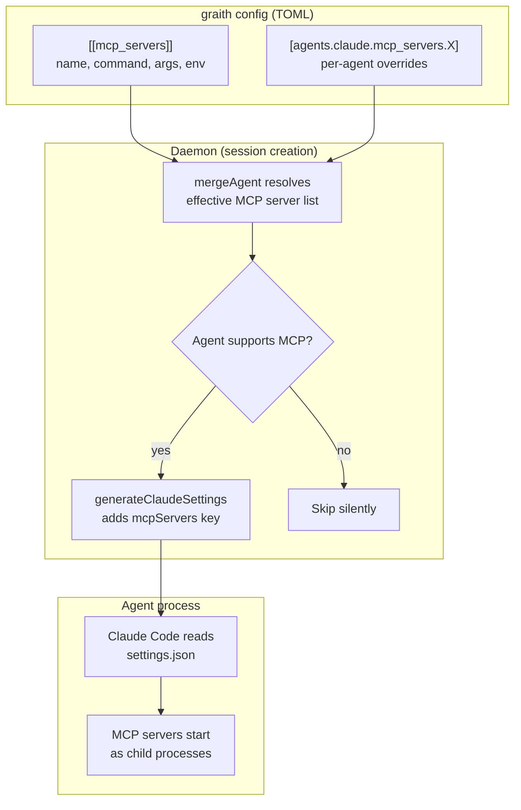

# Design Doc: MCP Server Injection

## Background

graith manages AI coding agent sessions in isolated git worktrees. It already injects lifecycle hooks into agents at session creation — Claude Code gets a `settings.json` with hooks via `--settings`, Codex gets shell scripts via `CODEX_HOOKS_DIR`. This infrastructure is in `internal/daemon/hooks.go`.

The [Model Context Protocol (MCP)](https://modelcontextprotocol.io/) is a standard for connecting AI agents to external tools. graith itself already runs as an MCP server (`gr mcp`) exposing session management tools. Claude Code supports MCP servers via its `settings.json` `mcpServers` key.

- **Parent issue:** [d0ugal/graith#359](https://github.com/d0ugal/graith/issues/359)
- **Motivating use case:** Chrome DevTools MCP crashes inside graith's macOS Seatbelt sandbox due to Chrome's inner sandbox re-init. The workaround is to run Chrome externally and point `chrome-devtools-mcp` at it via `--browserUrl`. This needs a general way to inject MCP server configs into agents.

## Problem

Agents running inside graith have no access to MCP servers unless the user manually configures them in each agent's own settings. This creates several problems:

- **Sandbox conflicts:** MCP servers that launch sub-processes (Chrome, Playwright) crash inside the Seatbelt sandbox. Users must run these externally and manually wire up connection URLs.
- **Per-agent configuration burden:** Each agent type has its own config format for MCP servers. Users must duplicate MCP server definitions across `~/.claude/settings.json`, Codex config, etc.
- **No central management:** graith manages agent lifecycle but not their tool ecosystem. Adding a new MCP server to all sessions requires editing multiple agent configs manually.
- **graith's own MCP server is invisible:** `gr mcp` exposes session management tools (list, create, publish messages), but agents don't know about it unless manually configured.

## Goals

1. Users can declare MCP servers in graith's TOML config, and they are automatically injected into agent sessions at creation time.
2. graith's own MCP server (`gr mcp`) is auto-injected into all supporting agents by default.
3. MCP server config supports global and per-agent scoping, following the existing merge pattern used by `SandboxConfig`.
4. The injection mechanism is agent-specific and extensible — Claude Code today, other agents when they add MCP support.

### Non-Goals

- **Hot-reloading MCP servers into running sessions.** Claude Code doesn't support mid-session MCP changes. However, MCP config is NOT persisted in session state (unlike sandbox config) — it is re-evaluated from current config on every resume. This means users can add an MCP server to config and existing sessions will pick it up on their next resume, which is safe because MCP servers are independently started by the agent on launch.
- **Managing MCP server processes.** graith injects config telling agents how to launch MCP servers — it does not start or supervise MCP server processes itself.
- **Supporting agents that lack MCP support.** Codex, Agy, and OpenCode do not currently support MCP. When they do, injection handlers will be added. Until then, MCP servers configured globally are silently skipped for unsupported agents.

## Proposals

### Proposal 0: Do nothing

Users continue to manually configure MCP servers in each agent's native config. Chrome DevTools MCP remains unusable inside sandboxed sessions without manual workarounds. graith's own MCP server stays invisible to agents.

### Proposal 1: Config-driven MCP server injection

Declare MCP servers in graith's TOML config. At session creation, graith reads the merged config and injects matching servers into the agent's launch configuration.

**Architecture diagram:**



#### Config format

MCP servers are declared as an array of tables at the top level:

```toml
# Automatically injected into all agents that support MCP
[[mcp_servers]]
name = "graith"
command = "gr"
args = ["mcp"]

[[mcp_servers]]
name = "chrome-devtools"
command = "npx"
args = ["@anthropic-ai/chrome-devtools-mcp@latest", "--browserUrl", "http://127.0.0.1:9222"]
env = { DISPLAY = ":0" }
```

Each entry maps directly to a Claude Code MCP server definition:

| TOML field | Claude settings.json field | Required |
|------------|---------------------------|----------|
| `name`     | key in `mcpServers` map   | yes      |
| `command`  | `command`                 | yes      |
| `args`     | `args`                    | no       |
| `env`      | `env`                     | no       |

Per-agent overrides use the existing merge pattern:

```toml
# Disable chrome-devtools for codex (when codex adds MCP support)
[agents.codex.mcp_servers.chrome-devtools]
disabled = true

# Override args for a specific agent
[agents.claude.mcp_servers.chrome-devtools]
args = ["@anthropic-ai/chrome-devtools-mcp@latest", "--browserUrl", "http://127.0.0.1:9333"]
```

#### Auto-injection of graith MCP server

graith's own MCP server (`gr mcp`) is always injected as the `graith` MCP server, even if not declared in config. This gives agents access to session management tools (list sessions, publish messages, read messages, etc.) without any user configuration. The `GRAITH_SESSION_ID` and `GRAITH_SESSION_NAME` env vars set by the daemon are inherited by MCP child processes, so `gr mcp` automatically knows which session it belongs to.

Users can disable auto-injection using the same override mechanism as any other MCP server:

```toml
[[mcp_servers]]
name = "graith"
disabled = true
```

#### Injection mechanism — Claude Code

`generateClaudeSettings()` in `hooks.go` already produces a `settings.json` with hooks. The change adds an `mcpServers` key to the same JSON:

```json
{
  "hooks": { ... },
  "mcpServers": {
    "graith": {
      "command": "/opt/homebrew/bin/gr",
      "args": ["mcp"]
    },
    "chrome-devtools": {
      "command": "npx",
      "args": ["@anthropic-ai/chrome-devtools-mcp@latest", "--browserUrl", "http://127.0.0.1:9222"]
    }
  }
}
```

Claude Code reads this via `--settings` and starts MCP servers as child processes. No new CLI flags or protocol changes needed.

#### Injection mechanism — other agents

Each agent has its own config format and injection path. Where possible, graith avoids writing to the worktree by using env vars or CLI flags. MCP config files are written to `~/.graith/mcp/` (one per agent type, not per session) and referenced by flag/env/symlink.

| Agent    | MCP support | Injection mechanism | Output location |
|----------|-------------|---------------------|-----------------|
| Claude   | Yes | `--settings` flag (existing path) | `hooks/<id>/settings.json` |
| Codex    | Yes | `--profile graith` flag → TOML profile file | `~/.graith/mcp/codex-mcp.config.toml` |
| OpenCode | Yes | `OPENCODE_CONFIG_CONTENT` env var (inline JSON) | None (env var) |
| Agy      | Yes | `.gemini/settings.json` symlink in worktree → file in data dir | `~/.graith/mcp/gemini-settings.json` → symlinked as `.gemini/settings.json` in worktree |

**Codex** supports `--profile <name>` which loads an additional TOML config layer on top of the user's base config. graith generates a profile file containing `[mcp_servers.X]` tables. This preserves the user's existing Codex config while layering MCP servers on top. The profile file maps fields directly: `command`, `args`, `env` are identical; `disabled` maps to `enabled = false`.

**OpenCode** supports `OPENCODE_CONFIG_CONTENT` env var with inline JSON config, deep-merged with project/global configs. No files needed — the cleanest injection path. Format differences: `command` + `args` combine into a single `command` string array, `env` becomes `environment`, and each entry needs `"type": "local"`.

**Agy (Gemini CLI)** reads `.gemini/settings.json` from the project root. The format is identical to Claude Code (`mcpServers` with `command`, `args`, `env`). graith writes the config to `~/.graith/mcp/gemini-settings.json` and symlinks it into the worktree as `.gemini/settings.json`. If the repo already has a `.gemini/settings.json`, graith reads and merges `mcpServers` into it. The symlink (or modified file) is added to `.git/info/exclude` to prevent dirty git state.

Each injection function handles the format translation from graith's canonical `MCPServerConfig` to the agent's native format. Agents without MCP support silently skip injection — no error, just a debug log.

#### Sandbox interaction

MCP servers launched by the agent run inside the agent's sandbox. For servers that need resources outside the sandbox (like Chrome DevTools connecting to an external Chrome), the user must ensure the necessary network access is allowed. Loopback (`127.0.0.1`) is allowed by default in graith's sandbox rules.

MCP server binaries (e.g., `npx`, `node`) must be in paths readable by the sandbox. The sandbox's `read_dirs` should include paths where MCP server binaries live (e.g., `~/.npm`, `/opt/homebrew`). Note that `npx` also needs **write access** to the npm cache (`~/.npm/_npx`) to download packages on first run. Users should either add `write_dirs = ["~/.npm"]` to their sandbox config, or install MCP servers globally (`npm install -g`) and reference the absolute binary path instead of `npx`.

#### Settings merge behavior

Claude Code's `--settings` flag provides project-level settings that merge with user/global settings. Graith-injected MCP servers are **additive** — they do not replace servers the user has configured in `~/.claude/settings.json`. If a name collision occurs (e.g., user has `graith` in their own settings AND graith auto-injects one), Claude Code's merge behavior determines which wins (project-level `--settings` takes precedence).

#### Merge semantics

Per-agent overrides use **full replacement** for `args` and `env`, consistent with `mergeAgent()` behavior for agent `Env` (config.go:365). If a per-agent override specifies `env`, it replaces the global MCP server's `env` entirely — it does not merge individual keys.

Per-agent overrides that reference a name not in the global list are treated as **agent-specific MCP servers** — they are added to that agent's server list without requiring a global declaration.

#### Chrome DevTools use case

With this feature, the Chrome DevTools workflow becomes:

1. User starts Chrome externally with `--remote-debugging-port=9222`
2. User adds to graith config:
   ```toml
   [[mcp_servers]]
   name = "chrome-devtools"
   command = "npx"
   args = ["@anthropic-ai/chrome-devtools-mcp@latest", "--browserUrl", "http://127.0.0.1:9222"]
   ```
3. New sessions automatically get Chrome DevTools MCP — agents can navigate pages, take screenshots, run Lighthouse audits, etc.
4. No custom Chrome lifecycle management in graith. No sandbox conflicts.

#### Pros

- Follows existing patterns — same merge logic as `SandboxConfig`, same settings.json injection path
- Single source of truth for MCP servers across all agent types
- graith MCP auto-injection means agents can manage sessions out of the box
- Minimal code change — extends `generateClaudeSettings()` and adds a config struct
- No new daemon state, protocol messages, or CLI commands

#### Cons

- Static at session creation — changing MCP config requires creating new sessions
- Only works for Claude Code today (other agents silently skip)
- MCP servers run as agent child processes, not managed by graith — if one crashes, the agent must handle it

## Consensus

TBD — to be filled after review and discussion.

## Other Notes

### References

- [Model Context Protocol specification](https://modelcontextprotocol.io/)
- [Claude Code settings.json documentation](https://docs.anthropic.com/en/docs/claude-code/settings)
- [d0ugal/graith#359 — Feature: start Chrome with remote debugging](https://github.com/d0ugal/graith/issues/359)
- [chrome-devtools-mcp](https://github.com/anthropics/chrome-devtools-mcp)
- Existing hook injection: `internal/daemon/hooks.go`
- Existing config merge: `internal/config/config.go` (`SandboxConfig.Merge()`)

### Implementation Notes

- **Config structs:** Add `MCPServerConfig` struct (`Name`, `Command`, `Args`, `Env`, `Disabled`) and `MCPServers []MCPServerConfig` to `Config`. Add `MCPServers map[string]MCPServerConfig` to `Agent` for per-agent overrides (map keyed by server name).
- **Two-level merge:**
  1. **Config load time** (`mergeAgent()` in config.go): Preserve user's per-agent `MCPServers` map, same as `Sandbox` and `Chrome` fields. No special merge logic needed here.
  2. **Session creation time** (new `mergeMCPServers()` function): Takes global `[]MCPServerConfig` list + per-agent `map[string]MCPServerConfig` overrides. Iterates global list by name, applies overrides (replace `args`/`env`/`command`, honor `disabled`). Per-agent entries not in global list are added as agent-specific servers.
- **Auto-injection:** Before merging, prepend a `graith` entry (using `resolveGrBin()`) to the global list. If the user has declared `name = "graith"` with `disabled = true` in the global list, the prepended entry is overridden.
- **Signature changes:** `injectHooks(agentName, sessionID)` → `injectHooks(agentName, sessionID, mcpServers []MCPServerConfig)`. Cascades to `injectClaudeHooks` → `generateClaudeSettings`. The caller in daemon.go calls `mergeMCPServers()` and passes the result.
- **Validation:** `Config.Validate()` should enforce: no duplicate `name` values in `[[mcp_servers]]`, `command` is required (non-empty) for non-disabled entries.
- **Serialization:** Use `omitempty` on `Args` and `Env` fields to avoid emitting `null` in JSON output.
- **Agent-specific injection functions:** `injectCodexMCP()` (generate TOML profile file, return `--profile` in `extraArgs`), `injectOpenCodeMCP()` (generate JSON string, return `OPENCODE_CONFIG_CONTENT` in `extraEnv`), `injectAgyMCP()` (write JSON to data dir, symlink into worktree). Each translates `MCPServerConfig` to the agent's native format.
- **Restructure `injectHooks`:** Rename to `injectAgentConfig` (or similar). Currently errors for agents without hook support. With MCP injection, OpenCode and Agy support MCP but not hooks — the function should handle both independently and only error if an agent supports neither.
- **MCP config file location:** Write to `~/.graith/mcp/` (one file per agent type). These are regenerated when config changes, not per-session. Claude is the exception — its `settings.json` is per-session (in hooks dir) because it bundles hooks + MCP together.
- **No state changes:** No new fields in `SessionState`, no state migration needed. MCP config is re-evaluated from current config on every create/resume.
- **No protocol changes:** MCP injection happens entirely within the existing hook/agent-config injection path.
- **Existing code to extend:** `hooks.go`, `config.go`, `default_config.toml`.
