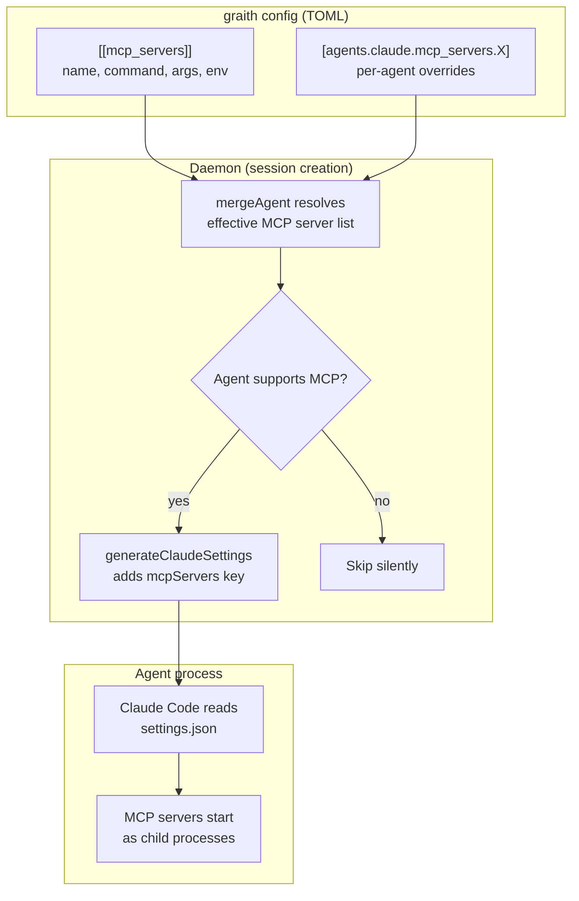

# Design Doc: MCP Server Injection

## Background

graith manages AI coding agent sessions in isolated git worktrees. It already injects lifecycle hooks into agents at session creation — Claude Code gets a `settings.json` with hooks via `--settings`, Codex gets shell scripts via `CODEX_HOOKS_DIR`. This infrastructure is in `internal/daemon/hooks.go`.

The [Model Context Protocol (MCP)](https://modelcontextprotocol.io/) is a standard for connecting AI agents to external tools. graith itself already runs as an MCP server (`gr mcp`) exposing session management tools. Claude Code supports MCP servers via its `settings.json` `mcpServers` key.

- **Parent issue:** [d0ugal/graith#359](https://github.com/d0ugal/graith/issues/359)
- **Motivating use case:** Chrome DevTools MCP crashes inside graith's macOS Seatbelt sandbox due to Chrome's inner sandbox re-init. The workaround is to run Chrome externally and point `chrome-devtools-mcp` at it via `--browserUrl`. This needs a general way to inject MCP server configs into agents.

## Problem

Agents running inside graith have no access to MCP servers unless the user manually configures them in each agent's own settings. This creates several problems:

- **Sandbox conflicts:** MCP servers that launch sub-processes (Chrome, Playwright) crash inside the Seatbelt sandbox. Users must run these externally and manually wire up connection URLs.
- **Per-agent configuration burden:** Each agent type has its own config format for MCP servers. Users must duplicate MCP server definitions across `~/.claude/settings.json`, Codex config, etc.
- **No central management:** graith manages agent lifecycle but not their tool ecosystem. Adding a new MCP server to all sessions requires editing multiple agent configs manually.
- **graith's own MCP server is invisible:** `gr mcp` exposes session management tools (list, create, publish messages), but agents don't know about it unless manually configured.

## Goals

1. Users can declare MCP servers in graith's TOML config, and they are automatically injected into agent sessions at creation time.
2. graith's own MCP server (`gr mcp`) is auto-injected into all supporting agents by default.
3. MCP server config supports global and per-agent scoping, following the existing merge pattern used by `SandboxConfig`.
4. The injection mechanism is agent-specific and extensible — Claude Code today, other agents when they add MCP support.

### Non-Goals

- **Hot-reloading MCP servers into running sessions.** MCP config is baked at session creation, same as sandbox config. Claude Code doesn't support mid-session MCP changes anyway.
- **Managing MCP server processes.** graith injects config telling agents how to launch MCP servers — it does not start or supervise MCP server processes itself.
- **Supporting agents that lack MCP support.** Codex, Agy, and OpenCode do not currently support MCP. When they do, injection handlers will be added. Until then, MCP servers configured globally are silently skipped for unsupported agents.

## Proposals

### Proposal 0: Do nothing

Users continue to manually configure MCP servers in each agent's native config. Chrome DevTools MCP remains unusable inside sandboxed sessions without manual workarounds. graith's own MCP server stays invisible to agents.

### Proposal 1: Config-driven MCP server injection

Declare MCP servers in graith's TOML config. At session creation, graith reads the merged config and injects matching servers into the agent's launch configuration.

**Architecture diagram:**



#### Config format

MCP servers are declared as an array of tables at the top level:

```toml
# Automatically injected into all agents that support MCP
[[mcp_servers]]
name = "graith"
command = "gr"
args = ["mcp"]

[[mcp_servers]]
name = "chrome-devtools"
command = "npx"
args = ["@anthropic-ai/chrome-devtools-mcp@latest", "--browserUrl", "http://127.0.0.1:9222"]
env = { DISPLAY = ":0" }
```

Each entry maps directly to a Claude Code MCP server definition:

| TOML field | Claude settings.json field | Required |
|------------|---------------------------|----------|
| `name`     | key in `mcpServers` map   | yes      |
| `command`  | `command`                 | yes      |
| `args`     | `args`                    | no       |
| `env`      | `env`                     | no       |

Per-agent overrides use the existing merge pattern:

```toml
# Disable chrome-devtools for codex (when codex adds MCP support)
[agents.codex.mcp_servers.chrome-devtools]
disabled = true

# Override args for a specific agent
[agents.claude.mcp_servers.chrome-devtools]
args = ["@anthropic-ai/chrome-devtools-mcp@latest", "--browserUrl", "http://127.0.0.1:9333"]
```

#### Auto-injection of graith MCP server

graith's own MCP server (`gr mcp`) is always injected as the `graith` MCP server, even if not declared in config. This gives agents access to session management tools (list sessions, publish messages, read messages, etc.) without any user configuration.

Users can disable this with:

```toml
[mcp_servers_options]
auto_inject_graith = false
```

#### Injection mechanism — Claude Code

`generateClaudeSettings()` in `hooks.go` already produces a `settings.json` with hooks. The change adds an `mcpServers` key to the same JSON:

```json
{
  "hooks": { ... },
  "mcpServers": {
    "graith": {
      "command": "/opt/homebrew/bin/gr",
      "args": ["mcp"]
    },
    "chrome-devtools": {
      "command": "npx",
      "args": ["@anthropic-ai/chrome-devtools-mcp@latest", "--browserUrl", "http://127.0.0.1:9222"]
    }
  }
}
```

Claude Code reads this via `--settings` and starts MCP servers as child processes. No new CLI flags or protocol changes needed.

#### Injection mechanism — future agents

When other agents add MCP support, injection handlers are added to `injectHooks()` alongside the existing hook injection:

| Agent    | MCP support | Injection path |
|----------|-------------|----------------|
| Claude   | Yes (settings.json `mcpServers`) | Extend `generateClaudeSettings()` |
| Codex    | Not yet | Future: likely env var or config file |
| OpenCode | Not yet | Future: TBD |
| Agy      | Not yet | Future: TBD |

Unsupported agents silently skip MCP injection — no error, just a debug log.

#### Sandbox interaction

MCP servers launched by the agent run inside the agent's sandbox. For servers that need resources outside the sandbox (like Chrome DevTools connecting to an external Chrome), the user must ensure the necessary network access is allowed. Loopback (`127.0.0.1`) is allowed by default in graith's sandbox rules.

MCP server binaries (e.g., `npx`, `node`) must be in paths readable by the sandbox. The sandbox's `read_dirs` should include paths where MCP server binaries live (e.g., `~/.npm`, `/opt/homebrew`).

#### Chrome DevTools use case

With this feature, the Chrome DevTools workflow becomes:

1. User starts Chrome externally with `--remote-debugging-port=9222`
2. User adds to graith config:
   ```toml
   [[mcp_servers]]
   name = "chrome-devtools"
   command = "npx"
   args = ["@anthropic-ai/chrome-devtools-mcp@latest", "--browserUrl", "http://127.0.0.1:9222"]
   ```
3. New sessions automatically get Chrome DevTools MCP — agents can navigate pages, take screenshots, run Lighthouse audits, etc.
4. No custom Chrome lifecycle management in graith. No sandbox conflicts.

#### Pros

- Follows existing patterns — same merge logic as `SandboxConfig`, same settings.json injection path
- Single source of truth for MCP servers across all agent types
- graith MCP auto-injection means agents can manage sessions out of the box
- Minimal code change — extends `generateClaudeSettings()` and adds a config struct
- No new daemon state, protocol messages, or CLI commands

#### Cons

- Static at session creation — changing MCP config requires creating new sessions
- Only works for Claude Code today (other agents silently skip)
- MCP servers run as agent child processes, not managed by graith — if one crashes, the agent must handle it

## Consensus

TBD — to be filled after review and discussion.

## Other Notes

### References

- [Model Context Protocol specification](https://modelcontextprotocol.io/)
- [Claude Code settings.json documentation](https://docs.anthropic.com/en/docs/claude-code/settings)
- [d0ugal/graith#359 — Feature: start Chrome with remote debugging](https://github.com/d0ugal/graith/issues/359)
- [chrome-devtools-mcp](https://github.com/anthropics/chrome-devtools-mcp)
- Existing hook injection: `internal/daemon/hooks.go`
- Existing config merge: `internal/config/config.go` (`SandboxConfig.Merge()`)

### Implementation Notes

- **Config struct:** Add `MCPServerConfig` struct and `MCPServers []MCPServerConfig` to `Config`. Add `MCPServers map[string]MCPServerOverride` to `Agent` for per-agent overrides.
- **Merge logic:** Add `mergeMCPServers()` following the `SandboxConfig.Merge()` pattern — global list as base, per-agent overrides can disable or change args/env.
- **Hook injection:** Extend `generateClaudeSettings()` to accept merged MCP server list and include `mcpServers` in the JSON output.
- **gr binary path:** Use `resolveGrBin()` (already exists in hooks.go) for the auto-injected graith MCP server command path.
- **Existing code to extend:** `hooks.go:generateClaudeSettings()`, `config.go:mergeAgent()`, `config.go:Config` struct, `default_config.toml`.
- **No state changes:** No new fields in `SessionState`, no state migration needed.
- **No protocol changes:** MCP injection happens entirely within the existing hook injection path.
