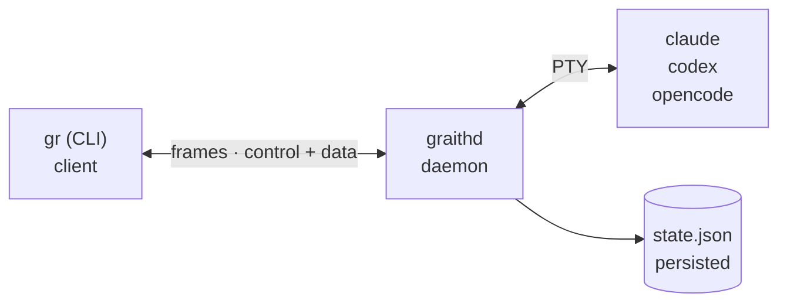

**Run a fleet of AI coding agents in parallel — each in its own git worktree, each in a session that outlives your terminal.**

graith is a terminal multiplexer built for AI coding agents (Claude, Codex, OpenCode, Cursor, Agy). Spin up an agent per task, keep each one isolated on its own branch, and switch between them with a tmux-style prefix key. The binary is called `gr`.

**graith** (Scots) -- *noun:* equipment, tools, gear for a specific trade. *verb:* to make ready, prepare, equip.

## How it works

A long-lived daemon (`graithd`) owns the PTY sessions and persists state; a stateless CLI client (`gr`) connects over a Unix socket using a framed binary protocol. Because the daemon holds the sessions, they survive terminal closures, daemon restarts, and SSH disconnections.

The wire protocol uses 5-byte framed multiplexing: `[channel:1][length:4][payload:N]`. See [Architecture]() for protocol details.

## Core concepts

**Sessions** are the primary unit of work. Each session has a name, an agent process, and (usually) a git worktree on its own branch. Sessions can be created, attached, detached, stopped, resumed, forked, and deleted.

**Worktrees** provide git-level isolation. Each session gets its own worktree and branch, so agents can work on different tasks in the same repo without conflicts.

**The prefix key** (default `ctrl+b`) intercepts keystrokes while attached. Press the prefix followed by a command key (e.g. `w` for the session picker, `d` to detach).

**Messaging** enables inter-agent communication via a SQLite-backed pub/sub system. Sessions can publish to topics, send direct messages, and subscribe to streams.

**The store** persists documents across sessions. It is a flat-file, git-backed key-value store scoped per-repo (or global with `--shared`).

**The todo list** is a durable, queryable list of work, shared across a session subtree or a scenario, with atomic claiming so parallel agents draining one list never double-work an item.
