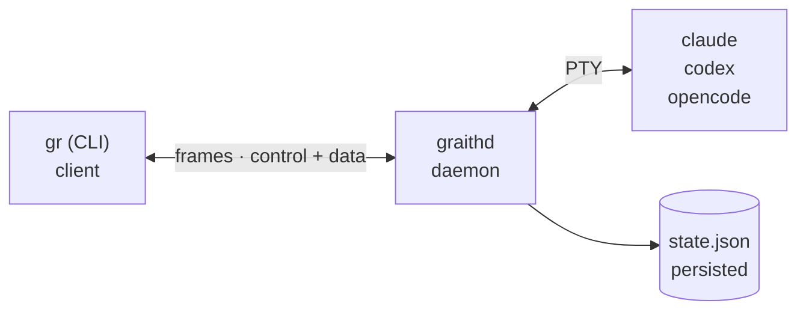



**Run a fleet of AI coding agents in parallel — each in a session that outlives your terminal.**

graith is a terminal multiplexer for AI coding agents (Claude, Codex, OpenCode, Cursor, Agy). Spin up an agent per task and switch between them with a tmux-style prefix key. The binary's called `gr`.

**graith** (Scots) -- *noun:* equipment, tools, gear for a specific trade. *verb:* to make ready, prepare, equip.

## How it works

A long-lived daemon (`graithd`) owns the PTY sessions and persists state; the stateless `gr` CLI connects over a Unix socket with a framed binary protocol. Sessions survive terminal closures, daemon restarts, and SSH disconnections.

The wire protocol uses 5-byte framed multiplexing: `[channel:1][length:4][payload:N]`. See [Architecture]() for details.

## Core concepts

**Sessions** are the primary unit of work — a name, an agent process, and (usually) a git worktree on its own branch. Create, attach, detach, stop, resume, fork, delete.

**Worktrees** give git-level isolation: a session's own branch lets agents work different tasks in one repo without conflicts.

**The prefix key** (default `ctrl+b`) intercepts keystrokes while attached — press it, then a command key (`w` session picker, `d` detach).

**Messaging** is inter-agent pub/sub, SQLite-backed: publish to topics, send direct messages, subscribe to streams.

**The store** persists documents across sessions — a flat-file, git-backed key-value store, per-repo or global with `--shared`.

**The todo list** is a durable, queryable list of work shared across a session subtree or scenario. Atomic claiming stops parallel agents draining one list from double-working an item.
