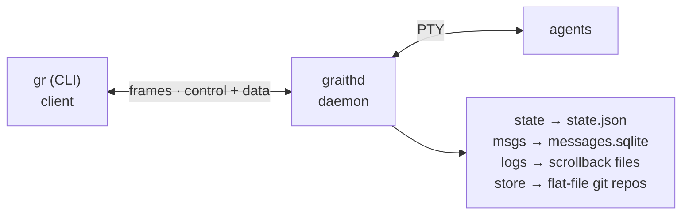

## Overview

A long-lived daemon (`graithd`) owns PTY sessions and persists state; a stateless CLI client (`gr`) connects over a Unix socket.



## Wire protocol

5-byte framed multiplexing:

```
[channel:1 byte][length:4 bytes big-endian][payload:N bytes]
```

Three channels:

| Channel | Purpose |
|---------|---------|
| `0x00` | JSON control messages |
| `0x01` | Raw PTY data |
| `0x02` | MCP proxy traffic |

Control messages use a JSON envelope:

```json
{"type": "create", "payload": {"name": "fix-bug", "agent": "claude", ...}}
```

The client sends a message type; the daemon responds with a matching response type or `error`. The protocol is versioned (`1.0`) and checked during handshake.

### Message types

**Client to daemon:**

| Type | Purpose |
|------|---------|
| `handshake` | Initial connection setup (version, terminal size, cwd) |
| `create` | Create a new session |
| `fork` | Fork a session |
| `attach` | Attach to a session |
| `detach` | Detach from a session |
| `delete` | Delete a session |
| `update` | Atomically update session name, parent, and/or starred state |
| `stop` | Stop a session |
| `resume` | Resume a stopped session |
| `restart` | Restart a session |
| `list` | List all sessions |
| `logs` | Stream session output |
| `type` | Type into a session's PTY |
| `resize` | Resize the PTY |
| `upgrade` | Upgrade daemon binary |
| `msg_pub` | Publish a message |
| `msg_sub` | Subscribe to messages |
| `msg_ack` | Acknowledge messages |
| `msg_topics` | List message topics |
| `set_status` | Set session status summary |
| `status_report` | Report agent hook status |
| `command_policy_check` | Synchronously evaluate an optional shell command restriction |
| `mcp_connect` | Connect to an MCP server |
| `reload` | Reload config |
| `diagnostics` | Request diagnostics |
| `screen_preview` | Request screen preview |
| `screen_snapshot` | Request screen snapshot |

**Daemon to client:**

| Type | Purpose |
|------|---------|
| `handshake_ok` | Handshake successful |
| `session_list` | List of sessions |
| `error` | Error message |
| `detached` | Session detached |
| `logs_done` | Log streaming complete |
| `msg_message` | Message data |
| `msg_done` | Message streaming complete |
| `msg_following` | Following mode active |
| `command_policy_decision` | Immediate allow/deny command-policy result |
| `status_set` | Status set confirmation |
| `screen_preview_response` | Screen preview data |
| `screen_snapshot_response` | Full screen snapshot |
| `mcp_connect_ok` | MCP connection established |
| `status_response` | Status query response |
| `diagnostics` | Diagnostics data |

## Daemon

The daemon (`SessionManager`) is the central component:

- **Session lifecycle:** create, stop, resume, restart, delete, fork
- **PTY management:** spawning, resizing, I/O multiplexing
- **State persistence:** `state.json` loaded on start, saved on mutations
- **Worktree management:** git worktrees and branches
- **Client handling:** connection acceptance, frame demuxing, message dispatch
- **Hook reporting:** agent status from hook reports
- **Command policy:** bounded synchronous shell checks that can only deny before agent execution
- **MCP management:** proxying MCP connections for sessions
- **Git pull:** periodic background pulls (when enabled)
- **Idle timeout:** auto-stop after inactivity

### State persistence

`state.json` stores session metadata: ID, name, agent type, repo path, worktree path, branch, status, parent ID, starred flag, and timestamps. It's loaded on daemon start and written synchronously on every mutation. Runtime-only state — hook reports, attached clients, in-memory caches — isn't persisted; it's rebuilt from PTY state on restart.

**State-version backups.** The state file carries a schema version; a newer daemon migrates an older `state.json` forward in place. Since a downgraded binary won't start against forward-migrated state, the daemon *first* writes a crash-safe copy of the pre-migration file to `state.json.v<oldVersion>.bak` (alongside `state.json`). Only the most recent backup is kept — an earlier one is removed once the new one is durable. To recover a downgrade: stop the daemon, restore the backup over `state.json` (e.g. `mv state.json.v16.bak state.json`), and start the older binary. `gr doctor` lists available backups.

### Session manager locking

`SessionManager` uses a `sync.RWMutex`: reads (list, info) take a read lock; mutations (create, delete, stop) take a write lock. The handler dispatches all control messages through it.

## Client

The client is stateless. Each command connects to the Unix socket, sends a handshake (version, terminal size, working directory) then the command-specific control message, reads the response, and disconnects.

For `attach`, the client loops between three modes, switching on prefix key commands and overlay actions:

1. **Passthrough mode:** raw terminal I/O forwarded to/from the daemon
2. **Overlay mode:** session picker TUI (Bubble Tea)
3. **Shell mode:** interactive shell in the worktree

### Passthrough

- Terminal is set to raw mode
- stdin is read in a goroutine and forwarded to the daemon on channel `0x01`; daemon output on `0x01` is written to stdout
- Control messages on channel `0x00` are processed (detach, status updates, screen snapshots)
- The prefix key intercepts the next keystroke for commands
- SIGWINCH signals trigger PTY resize messages

### Overlay

A full-screen TUI built with [Bubble Tea](https://github.com/charmbracelet/bubbletea), rendering session lists with filtering, view modes, and a live preview panel. The preview uses [vt10x](https://github.com/hinshun/vt10x) to parse terminal output into a rendered screen.


## PTY management

Each session's PTY (`pty/session.go`) spawns the agent process with a pseudoterminal, multiplexes output to the attached client (if any) and the scrollback file, handles resize signals, and manages process lifecycle (start, stop, restart).

### Scrollback

PTY output is appended to a scrollback file (`pty/scrollback.go`) supporting append-only writes (concurrent-safe), tail reads (`gr logs --lines N`), and follow reads (`gr logs --follow`).

## Messaging

The messaging system (`daemon/msgstore.go`) uses SQLite. Messages carry stream name, body, sender info, thread ID, reply-to, and timestamp; subscriber positions are tracked per-stream for unread counting. `--wait` and `--follow` poll with notification channels. Retention is enforced by `max_age` and `max_per_stream`.

## Document store

The store (`store/store.go`) operates directly on disk. Each store is a git repository (`git init`): writes commit with `git add` + `git commit`, deletes with `git rm` + `git commit`. Keys are strictly validated (no path traversal, no special characters). Per-repo stores are named `<repo-name>-<hash>` from the canonical repo path; the shared store uses a fixed `shared` directory.

## Sandbox

When sandbox is enabled (`sandbox/sandbox.go`), the backend is pluggable — selected with `[sandbox] backend` (`safehouse` = macOS `sandbox-exec`; `nono` = Landlock+seccomp on Linux / Seatbelt on macOS). `backend` is required when enabled; an unset backend fails closed.

1. The daemon resolves the merged sandbox config (global + per-agent)
2. `~` paths and globs are expanded to absolute
3. The backend wraps the command — either `safehouse wrap` (`sandbox/safehouse.go`) or a generated per-session nono JSON profile run via `nono run --profile` (`sandbox/nono.go`)
4. Before session creation, the daemon checks the backend can enforce (binary present, kernel/version adequate, network policy supported); if not, creation fails closed

## Agent detection

`agent/agent.go` detects AI agent environments from environment variables: `GRAITH_SESSION_ID`, `CLAUDECODE`, `CLAUDE_CODE`, `CURSOR_AGENT`, `GITHUB_COPILOT`, `AMAZON_Q`, `OPENCODE`. When detected, JSON output is auto-enabled. Override with `GR_AGENT_MODE=0` or `GR_AGENT_MODE=1`.

## Package layout

```
cmd/graith/              Entry point (main.go)
internal/
  agent/                 Agent environment detection
  cli/                   Cobra command definitions (one file per command)
  client/                Client: connection, passthrough, overlay, shell, status bar
  config/                TOML config loading, defaults, XDG paths
  daemon/                Daemon: session manager, handler, state, server, messaging, MCP manager
  detector/              Agent type detection from running processes
  git/                   Git operations (fetch, worktree, branch)
  hookoutput/            Agent-specific hook response formatting
  integration/           Integration tests (spawn real daemon)
  mcp/                   MCP server implementation
  output/                Structured output helpers (text/JSON)
  protocol/              Wire protocol: framing, control messages, encoding
  pty/                   PTY session management, scrollback buffer
  sandbox/               Pluggable OS sandbox backends (safehouse, nono)
  store/                 Flat-file git-backed document store
  version/               Build-time version injection
```

All packages live under `internal/`; there's no public Go API.
