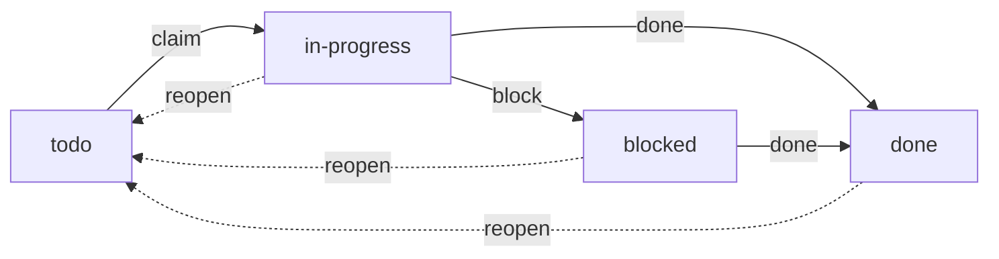

The todo list is a durable, queryable list of work owned by the daemon — a
first-class primitive alongside [messaging](), the
[store](), and [scenarios]().
Unlike an agent's in-context checklist, todo items **survive session end, resume,
compaction, and daemon restart**, are visible across a session subtree or a whole
scenario, and can be **claimed atomically** so parallel agents draining one list
never double-work the same item.

Agents drive it through `gr todo`; the human sees "what's left" across the fleet
in `gr list` and the overlay.

## Items

Each item has:

| Field | Description |
|-------|-------------|
| `id` | Stable identifier (`td-…`) |
| `title` | Short description of the work |
| `status` | `todo`, `in-progress`, `done`, or `blocked` |
| `scope` | Which list it belongs to — a session subtree or a scenario |
| `owner` | The session currently working it — set by the claim, **never** the caller |
| `assignee` | The member responsible for it (used for scenario completion) |
| `parent_id` | An optional parent item — one level of sub-items |
| `tags` | Free-form labels for filtering |
| `note` | An optional one-line note (e.g. why an item is blocked) |

Statuses move through a small state machine:



`reopen` clears the owner and returns an item to `todo` so it can be claimed
again (from `in-progress`, `blocked`, or `done`); a `blocked` item can be
completed directly once its blocker clears. Sub-items are one level deep (a sub-item can't itself have children),
share their parent's scope, and are removed with their parent.

## Scoping

Every item belongs to exactly one list, identified by its **scope**. There is no
free-floating global list — scoping mirrors how graith already draws coordination
boundaries.

- **Session subtree (default).** `gr todo add` anchors the item to the **root of
  your session subtree** — the daemon walks your `GRAITH_SESSION_ID` up its parent
  chain to the topmost session. A parent and its children therefore share **one**
  list, so an orchestrator and the sessions it spawns coordinate over a common
  backlog. Any session in the subtree can read and claim; a session outside it
  cannot.
- **Scenario.** Pass `--scenario <name>` to work a scenario's shared list. Every
  member of the scenario — including shared sessions — can read and claim from it.

The local human (`gr` from the shell) is in every scope.

## CLI

```bash
# Add to my subtree's list
gr todo add "Wire the claim CAS" --tag backend --tag p1
gr todo add "Write the regression test" --parent td-abc123   # a sub-item
gr todo add "Draft the release notes" --scenario strath      # a scenario list

# List (grouped by status)
gr todo list                          # my subtree's items
gr todo list --status blocked         # filter by status
gr todo list --tag backend            # filter by tag
gr todo list --scenario strath        # a scenario's shared list
gr todo list --all                    # fleet-wide, every scope (human/orchestrator)

# Claim and progress
gr todo claim td-abc123               # atomic claim → in-progress, owned by me
gr todo next                          # claim the next unclaimed item in my scope
gr todo start td-abc123               # alias for claim
gr todo done td-abc123                # → done
gr todo block td-abc123 "waiting on API review"   # → blocked, with a note
gr todo reopen td-abc123              # → todo, clears the owner

# Remove / export
gr todo rm td-abc123                  # removes the item (and any sub-items)
gr todo export scenario:strath        # dump a scope to a markdown/JSON store doc
```

Scope auto-resolves from `GRAITH_SESSION_ID` (anchored to the subtree root), so
inside a session you rarely pass a scope flag. `--session <id>` overrides the
auto-anchor for the rare case an agent wants a sub-list at itself. Inside an
agent, `gr todo` auto-enables `--json`, so agents get structured output for free
(see [agent mode]()).

Agents can also drive the same operations over
[MCP]() (`todo_list`, `todo_add`, `todo_claim`,
`todo_update`, `todo_done`, `todo_block`, `todo_reopen`), so an agent can plan
durably and drain a shared backlog without dropping to the shell.

## Claiming

Claiming is the correctness centrepiece: it is a single **atomic compare-and-set**
(`todo` **and** unclaimed → `in-progress`, owned by the caller). When two agents
race to claim the same item, exactly one wins and the other is told "already
claimed" — there is no read-then-write window and no double-claim. `gr todo next`
does the same over a whole scope, handing out the lowest-ordered unclaimed item,
so several agents can drain one backlog collision-free.

Ownership rules:

- **Claim** — any session **in scope** may claim an unclaimed item. `owner` is set
  to the calling session server-side; a session can never claim on another's
  behalf.
- **Transition a claimed item** (done / block / reopen / edit / remove) — only the
  **owner**, an **override authority** (the subtree's anchor root, or a scenario's
  orchestrator), or the **human**. A peer draining the same backlog can't close a
  sibling's in-progress item.
- **The human always wins** — consistent with every other subsystem. The human
  *assigns* work (creates and can transition any item) but does not claim by
  default; claiming is a session grabbing work for itself.

### Reclaiming stranded work

An agent can claim an item and then stop or crash before finishing, leaving it
`in-progress` under a dead session. Two defences return it to the pool:

- **On stop.** When a session stops or is soft-deleted, its `in-progress` items
  auto-reopen (`owner` cleared, back to `todo`) so a sibling can pick them up.
- **Claim lease.** An `in-progress` item that sees no progress for
  `[todo] claim_lease` is reopened automatically (see [configuration](#configuration)).

The override authority and the human can always `reopen` an item manually.

## Events

State changes can emit pub/sub events so reviewers and [triggers]()
react without polling. On each mutation the daemon publishes a compact JSON event
to the topic `todo:<scope>` (from the `graith:system` sender):

```json
{"event":"claimed","id":"td-abc","scope":"scenario:strath","owner":"def456","status":"in-progress"}
```

A session can react to work going `blocked` without polling:

```bash
gr msg sub --topic todo:scenario:strath --follow
```

Emission is controlled by the tri-state `[todo] emit_events`:

| Value | Behaviour |
|-------|-----------|
| `"scenario"` | Emit for scenario scopes only (default — keeps lone-session noise down) |
| `"all"` | Emit for every scope |
| `"off"` | Never emit |

Events are best-effort and fail-open — the table is the source of truth. Each item
carries a `revision`, so a consumer treats an event as a hint and re-reads the row,
discarding a stale event.

## In scenarios

Scenario progress is tracked through the todo system rather than a coarse
per-session boolean (this **replaces** the old `gr scenario task-done`):

- **Seeding.** At scenario start, each member with a `task` gets **one assigned
  todo item** in the scenario's scope (`assignee` = that member, title = the task).
  A member breaks its task down by adding sub-items.
- **`assignee` vs `owner`.** `assignee` is *who is responsible*; `owner` is *who is
  currently working it* (set by the claim). They usually coincide, but an
  orchestrator can assign work a member hasn't claimed yet.
- **Completion is derived, not declared.** A member is complete when it has at
  least one assigned item and every assigned item is `done`. A member with **no**
  assigned items reports "no tracked work" (`—`), neither pending nor complete.
  `gr scenario status` renders per-member `done/total` from real item state, and
  the scenario is complete once every member with tracked work is.

So the gesture a member used to make with `gr scenario task-done` is now
`gr todo done <its-task-item>` — the same "I finished my task" signal, backed by a
real object with sub-items, ordering, and derived progress.

## In `gr list` and the overlay

A `done/total` count column is available in both `gr list` and the overlay session
picker. It is **opt-in and off by default**, to keep the default table tight. The
column shows the count for a session's own subtree list; a scenario-wide total is
shown only on the scenario's orchestrator session, so fleet totals aren't inflated
by echoing it onto every member.

## Configuration

The optional `[todo]` block in `config.toml`:

```toml
[todo]
emit_events = "scenario"   # "scenario" (default) | "all" | "off"
claim_lease = "30m"        # reopen an in-progress item after this long with no progress
                           # ("0" disables the lease — stop-based reclaim only)
retention   = "7d"         # sweep done items older than this

# Operational limits (all optional; default shown):
max_title      = 500       # max todo title length in bytes (may only tighten below the 500 hard ceiling)
max_note       = 2000      # max todo note length in bytes (may only tighten below the 2000 hard ceiling)
list_limit     = 2000      # max items a single list returns (ceiling 100000)
sweep_interval = "1m"      # how often the lease/retention sweep runs
busy_timeout   = "5s"      # SQLite busy/operation timeout for the todos DB (unset => 5s; min 1ms, max 5m)
```

All fields are optional. `claim_lease`, `retention`, `sweep_interval`, and
`busy_timeout` are Go durations (e.g. `30m`, `7d`).

`max_title` and `max_note` are the enforced length limits. Their `500`/`2000`
defaults are also the **hard ceilings** baked into the database schema — config
may tighten them below the ceiling but never raise them past it, so a configured
limit can never exceed what the database will accept. `list_limit` bounds a
single list query. Over-limit values are rejected at config load.

Reloadability: the `claim_lease` and `retention` windows the sweep applies are
re-read each tick, so they take effect on the next `gr daemon reload`. The
`sweep_interval` cadence, `list_limit`, and `busy_timeout` are fixed when the
sweep loop starts and the database opens, so they are **restart-only** — change
them and run `gr daemon restart`. `max_title`/`max_note` are re-read per
operation (reloadable). `busy_timeout` is load-bearing for the claim contract:
it lets a contended writer wait for the lock instead of failing immediately. When
unset it uses the 5s default; a non-empty value must parse, be at least 1ms
(SQLite's `busy_timeout` pragma has millisecond resolution, so a sub-millisecond
value would collapse to zero and disable the contended-writer wait the claim
contract relies on), and be at most 5m — an invalid, zero, negative,
sub-millisecond, or over-ceiling value is rejected at load and reload.
