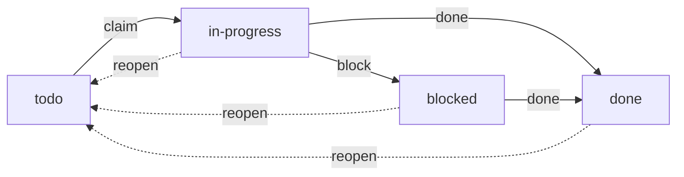

The todo list is a durable, queryable list of work owned by the daemon — a
first-class primitive alongside [messaging](), the
[store](), and [scenarios]().
Unlike an agent's in-context checklist, todo items **survive session end, resume,
compaction, and daemon restart**, are visible across a session subtree or a whole
scenario, and can be **claimed atomically** so parallel agents draining one list
never double-work the same item.

Agents drive it through `gr todo`; the human sees "what's left" across the fleet
in `gr list` and the overlay.

## Items

Each item has:

| Field | Description |
|-------|-------------|
| `id` | Stable identifier (`td-…`) |
| `title` | Short description of the work |
| `status` | `todo`, `in-progress`, `done`, or `blocked` |
| `scope` | Which list it belongs to — a session subtree or a scenario |
| `owner` | The session currently working it — set by the claim, **never** the caller |
| `assignee` | The member responsible for it (used for scenario completion) |
| `parent_id` | An optional parent item — one level of sub-items |
| `tags` | Free-form labels for filtering |
| `note` | An optional one-line note (e.g. why an item is blocked) |
| `depends_on` | Todo IDs that must all be done before the item is claimable |
| `blocked_by` | The currently unfinished subset of `depends_on` |

Statuses move through a small state machine:



`reopen` clears the owner and returns an item to `todo` so it can be claimed
again (from `in-progress`, `blocked`, or `done`); a `blocked` item can be
completed directly once its blocker clears. Sub-items are one level deep (a sub-item can't itself have children),
share their parent's scope, and are removed with their parent.

Dependency waiting is also shown as `blocked`, but it is ownerless and carries
`blocked_by` instead of relying on a manual note. Internally it remains an
unclaimed todo whose readiness is derived from the graph, so it cannot be
claimed until every dependency is done and cannot drift after a daemon restart.

## Scoping

Every item belongs to exactly one list, identified by its **scope**. There is no
free-floating global list — scoping mirrors how graith already draws coordination
boundaries.

- **Session subtree (default).** `gr todo add` anchors the item to the **root of
  your session subtree** — the daemon walks your `GRAITH_SESSION_ID` up its parent
  chain to the topmost session. A parent and its children therefore share **one**
  list, so an orchestrator and the sessions it spawns coordinate over a common
  backlog. Any session in the subtree can read and claim; a session outside it
  cannot.
- **Scenario.** Pass `--scenario <name>` to work a scenario's shared list. Every
  member of the scenario — including shared sessions — can read and claim from it.

The local human (`gr` from the shell) is in every scope.

## CLI

```bash
# Add to my subtree's list
gr todo add "Wire the claim CAS" --tag backend --tag p1
gr todo add "Write the regression test" --parent td-abc123   # a sub-item
gr todo add "Draft the release notes" --scenario strath      # a scenario list
gr todo add "Publish" --depends-on td-api --depends-on td-ui # wait for both
gr todo deps td-publish td-api td-ui       # replace its dependency set
gr todo deps td-publish                    # clear its dependency set

# List (grouped by status)
gr todo list                          # my subtree's items
gr todo list --status blocked         # filter by status
gr todo list --tag backend            # filter by tag
gr todo list --scenario strath        # a scenario's shared list
gr todo list --all                    # fleet-wide, every scope (human/orchestrator)

# Claim and progress
gr todo claim td-abc123               # atomic claim → in-progress, owned by me
gr todo next                          # claim the next eligible item in my scope
gr todo start td-abc123               # alias for claim
gr todo done td-abc123                # claimed item → done
gr todo block td-abc123 "waiting on API review"   # → blocked, with a note
gr todo reopen td-abc123              # → todo, clears the owner

# Remove / export
gr todo rm td-abc123                  # removes the item (and any sub-items)
gr todo export scenario:strath        # dump a scope to a markdown/JSON store doc
```

Scope auto-resolves from `GRAITH_SESSION_ID` (anchored to the subtree root), so
inside a session you rarely pass a scope flag. `--session <id>` overrides the
auto-anchor for the rare case an agent wants a sub-list at itself. Inside an
agent, `gr todo` auto-enables `--json`, so agents get structured output for free
(see [agent mode]()).

Agents can also drive the same operations over
[MCP]() (`todo_list`, `todo_add`, `todo_claim`,
`todo_update`, `todo_done`, `todo_block`, `todo_reopen`), so an agent can plan
durably and drain a shared backlog without dropping to the shell.

## Dependencies

Dependencies form a directed acyclic graph inside one scope. Adding or replacing
edges rejects missing IDs, self-dependencies, cycles, and cross-scope references
without changing the previous item or graph. Duplicate IDs are folded into one
edge. `gr todo list` includes a **WHY BLOCKED** column; JSON returns the full
`depends_on` list and current `blocked_by` subset.

Completing a dependency and making its newly-ready direct dependents claimable
happen in one todo-database transaction. When the final unfinished dependency
completes, each dependent's revision is bumped and an `unblocked` event is sent
on `todo:<scope>`. Multiple agents completing the final dependencies
concurrently still produce one readiness transition.

The less-obvious lifecycle cases are deliberate:

- Reopening a done dependency re-blocks unclaimed direct dependents. Work that
  is already `in-progress`, manually `blocked`, or `done` is not unwound.
- A manually blocked dependency remains unfinished, so its downstream work
  waits until the dependency is completed. There is no implicit skip or failure
  propagation.
- Removing a todo that another item depends on is rejected. Clear or replace
  the dependent edge first. Retention also keeps referenced done items and
  parents whose sub-items are still referenced.
- Reclaimed work returns ownerless. If its own dependencies are unfinished, it
  is shown as dependency-blocked instead of returning to the claimable pool.

All todo rows, dependency edges, cascade revisions, and block notes involved in
one mutation commit or roll back together. Event delivery uses the separate
message database and remains best-effort: a publish failure is logged without
rolling back committed todo state, and consumers reconcile from the item
revision.

## Claiming

Claiming is the correctness centrepiece: it is a single **atomic compare-and-set**
(`todo` **and** unclaimed → `in-progress`, owned by the caller). When two agents
race to claim the same item, exactly one wins and the other is told "already
claimed" — there is no read-then-write window and no double-claim. `gr todo next`
does the same over a whole scope, handing out the lowest-ordered eligible item,
so several agents can drain unassigned backlog collision-free without taking
work reserved for another assignee.

Ownership rules:

- **Claim** — any session **in scope** may claim an unassigned, unclaimed item.
  An assigned item is reserved for its `assignee`; only that session or the
  scope's override authority may claim it. `owner` is set to the calling session
  server-side, so a session can never claim on another's behalf.
- **Transition a claimed item** (done / block / reopen / edit / remove) — only the
  **owner**, an **override authority** (the subtree's anchor root, or a scenario's
  orchestrator), or the **human**. A peer draining the same backlog can't close a
  sibling's in-progress item.
- **The human always wins** — consistent with every other subsystem. The human
  *assigns* work (creates and can transition any item) but does not claim by
  default; claiming is a session grabbing work for itself.

### Reclaiming stranded work

An agent can claim an item and then stop or crash before finishing, leaving it
`in-progress` under a dead session. Two defences return it to the pool:

- **On stop.** When a session stops or is soft-deleted, its `in-progress` items
  auto-reopen (`owner` cleared). A ready item returns to `todo`; one with an
  unfinished dependency returns to dependency-blocked.
- **Claim lease.** An `in-progress` item that sees no progress for
  `[todo] claim_lease` is reopened automatically (see [configuration](#configuration)).

The override authority and the human can always `reopen` an item manually.

## Events

State changes can emit pub/sub events so reviewers and [triggers]()
react without polling. On each mutation the daemon publishes a compact JSON event
to the topic `todo:<scope>` (from the `graith:system` sender):

```json
{"event":"unblocked","id":"td-abc","scope":"scenario:strath","status":"todo","revision":4}
```

A session can react to work going `blocked` without polling:

```bash
gr msg sub --topic todo:scenario:strath --follow
```

Emission is controlled by the tri-state `[todo] emit_events`:

| Value | Behaviour |
|-------|-----------|
| `"scenario"` | Emit for scenario scopes only (default — keeps lone-session noise down) |
| `"all"` | Emit for every scope |
| `"off"` | Never emit |

Events are best-effort and fail-open — the table is the source of truth. Each item
carries a `revision`, so a consumer treats an event as a hint and re-reads the row,
discarding a stale event.

## In scenarios

Scenario progress is tracked through the todo system rather than a coarse
per-session boolean (this **replaces** the old `gr scenario task-done`):

- **Seeding.** At scenario start, each member with a `task` gets **one assigned
  todo item** in the scenario's scope (`assignee` = that member, title = the task).
  A member breaks its task down by adding sub-items. A session entry's
  `depends_on = ["member-name"]` references are resolved to these seeded items;
  all seed items and edges are inserted atomically.
- **`assignee` vs `owner`.** `assignee` is *who is responsible*; `owner` is *who is
  currently working it* (set by the claim). They usually coincide, but an
  orchestrator can assign work a member hasn't claimed yet.
- **Seed identity is stable.** Reassigning a scenario's seeded item changes
  current responsibility, but member-name dependencies continue to resolve the
  original member's seed.
- **Completion is derived, not declared.** A member is complete when it has at
  least one assigned item and every assigned item is `done`. A member with **no**
  assigned items reports "no tracked work" (`—`), neither pending nor complete.
  `gr scenario status` renders per-member `done/total` from real item state and
  names unfinished upstream members in **WAITING ON**. Its JSON response carries
  the same names in `blocked_by`. The scenario is complete once every member
  with tracked work is.

The seeded item starts ownerless. A member must claim it, then mark it done; an
attempt to skip the claim names the exact recovery command:

```bash
gr todo list --scenario "$GRAITH_SCENARIO_NAME" # find assignee=$GRAITH_SESSION_ID
gr todo claim <its-task-item>                    # sets owner, moves to in-progress
gr todo done <its-task-item>                     # moves to done
```

This is the same "I finished my task" signal formerly represented by
`gr scenario task-done`, now backed by a real object with sub-items, ordering,
and derived progress.

## In `gr list` and the overlay

A `done/total` count column is available in both `gr list` and the overlay session
picker. It is **opt-in and off by default**, to keep the default table tight. The
column shows the count for a session's own subtree list; a scenario-wide total is
shown only on the scenario's orchestrator session, so fleet totals aren't inflated
by echoing it onto every member.

## Configuration

The optional `[todo]` block in `config.toml`:

```toml
[todo]
emit_events = "scenario"   # "scenario" (default) | "all" | "off"
claim_lease = "30m"        # reopen an in-progress item after this long with no progress
                           # ("0" disables the lease — stop-based reclaim only)
retention   = "7d"         # sweep done items older than this

# Operational limits (all optional; default shown):
max_title      = 500       # max todo title length in bytes (may only tighten below the 500 hard ceiling)
max_note       = 2000      # max todo note length in bytes (may only tighten below the 2000 hard ceiling)
list_limit     = 2000      # max items a single list returns (ceiling 100000)
sweep_interval = "1m"      # how often the lease/retention sweep runs
busy_timeout   = "5s"      # SQLite busy/operation timeout for the todos DB ("" => 5s; explicit value must be 1ms–5m)
```

All fields are optional. `claim_lease`, `retention`, `sweep_interval`, and
`busy_timeout` are Go durations (e.g. `30m`, `7d`).

`max_title` and `max_note` are the enforced length limits. Their `500`/`2000`
defaults are also the **hard ceilings** baked into the database schema — config
may tighten them below the ceiling but never raise them past it, so a configured
limit can never exceed what the database will accept. `list_limit` bounds a
single list query. Over-limit values are rejected at config load.

Reloadability: the `claim_lease` and `retention` windows the sweep applies are
re-read each tick, so they take effect on the next `gr daemon reload`. The
`sweep_interval` cadence, `list_limit`, and `busy_timeout` are fixed when the
sweep loop starts and the database opens, so they are **restart-only** — change
them and run `gr daemon restart`. `max_title`/`max_note` are re-read per
operation (reloadable). `busy_timeout` is load-bearing for the claim contract:
it lets a contended writer wait for the lock instead of failing immediately.
SQLite's `busy_timeout` pragma has **millisecond resolution**, so a positive
value below `1ms` is rejected at load — it would otherwise collapse to
`busy_timeout(0)` and disable the wait the claim contract depends on.
