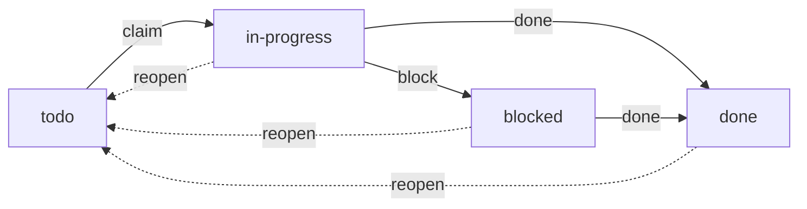

A durable list of work owned by the daemon — a primitive alongside
[messaging](), the
[store](), and [scenarios]().
Unlike an agent's in-context checklist, items **survive session end, resume,
compaction, and daemon restart**, are visible across a session subtree or
scenario, and are **claimed atomically** so parallel agents never double-work an
item. Agents drive it with `gr todo`; the human sees "what's left" in `gr list`
and the overlay.

## Items

Each item has:

| Field | Description |
|-------|-------------|
| `id` | Stable identifier (`td-…`) |
| `title` | Short description of the work |
| `status` | `todo`, `in-progress`, `done`, or `blocked` |
| `scope` | Which list it belongs to — a session subtree or a scenario |
| `owner` | The session currently working it — set by the claim, **never** the caller |
| `assignee` | The member responsible for it (used for scenario completion) |
| `parent_id` | An optional parent item — one level of sub-items |
| `tags` | Free-form labels for filtering |
| `note` | An optional one-line note (e.g. why an item is blocked) |
| `depends_on` | Todo IDs that must all be done before the item is claimable |
| `blocked_by` | The currently unfinished subset of `depends_on` |

Statuses move through a small state machine:



`reopen` clears the owner; a `blocked` item can complete directly once its
blocker clears. Sub-items are one level deep (no children), share their parent's
scope, and are removed with it.

Dependency waiting also shows `blocked`, but ownerless with `blocked_by` rather
than a note; its readiness derives from the graph, so it can't be claimed until
every dependency is done, and can't drift after a restart.

## Scoping

Every item belongs to exactly one list, identified by its **scope**; there's no
free-floating global list.

- **Session subtree (default).** `gr todo add` anchors the item to the **root of
  your subtree** — the daemon walks `GRAITH_SESSION_ID` up its parent chain to
  the topmost session. A parent and its children share **one** list. Any session
  in the subtree can read and claim; one outside can't.
- **Scenario.** Pass `--scenario <name>` for a scenario's shared list; every
  member, including shared sessions, can read and claim.

The local human (`gr` from the shell) is in every scope.

## CLI

```bash
# Add to my subtree's list
gr todo add "Wire the claim CAS" --tag backend --tag p1
gr todo add "Write the regression test" --parent td-abc123   # a sub-item
gr todo add "Draft the release notes" --scenario strath      # a scenario list
gr todo add "Publish" --depends-on td-api --depends-on td-ui # wait for both
gr todo deps td-publish td-api td-ui       # replace its dependency set
gr todo deps td-publish                    # clear its dependency set

# List (grouped by status)
gr todo list                          # my subtree's items
gr todo list --status blocked         # filter by status
gr todo list --tag backend            # filter by tag
gr todo list --scenario strath        # a scenario's shared list
gr todo list --all                    # fleet-wide, every scope (human/orchestrator)

# Claim and progress
gr todo claim td-abc123               # atomic claim → in-progress, owned by me
gr todo next                          # claim the next eligible item in my scope
gr todo start td-abc123               # alias for claim
gr todo done td-abc123                # claimed item → done
gr todo block td-abc123 "waiting on API review"   # → blocked, with a note
gr todo reopen td-abc123              # → todo, clears the owner

# Remove / export
gr todo rm td-abc123                  # removes the item (and any sub-items)
gr todo export scenario:strath        # dump a scope to a markdown/JSON store doc
```

Scope auto-resolves from `GRAITH_SESSION_ID` (anchored to the subtree root), so
you rarely pass a scope flag; `--session <id>` overrides the auto-anchor for a
sub-list at the agent itself. Inside an agent, `gr todo` auto-enables `--json`
(see [agent mode]()).

Agents can drive the same operations over [MCP]()
(`todo_list`, `todo_add`, `todo_claim`, `todo_update`, `todo_done`, `todo_block`,
`todo_reopen`).

## Dependencies

Dependencies form a directed acyclic graph inside one scope. Adding or replacing
edges rejects missing IDs, self-dependencies, cycles, and cross-scope references;
duplicate IDs fold into one edge. `gr todo list` includes a **WHY BLOCKED**
column; JSON returns the full `depends_on` list and current `blocked_by` subset.

Completing a dependency and making its newly-ready dependents claimable happen in
one transaction: when the final unfinished dependency completes, each dependent's
revision is bumped and an `unblocked` event fires on `todo:<scope>`. Concurrent
completions still produce one readiness transition.

Deliberate lifecycle cases:

- Reopening a done dependency re-blocks unclaimed direct dependents; work already
  `in-progress`, manually `blocked`, or `done` isn't unwound.
- A manually blocked dependency stays unfinished, so downstream work waits — no
  implicit skip or failure propagation.
- Removing a todo another item depends on is rejected — clear or replace the
  dependent edge first. Retention keeps referenced done items and parents whose
  sub-items are still referenced.

One mutation's todo rows, dependency edges, cascade revisions, and block notes
commit or roll back together. Events use the separate message database,
best-effort: a publish failure is logged without rolling back todo state, and
consumers reconcile from the item revision.

## Claiming

Claiming is the correctness centrepiece: a single **atomic compare-and-set**
(`todo` **and** unclaimed → `in-progress`, owned by the caller). When two agents
race, exactly one wins; the other is told "already claimed" — no double-claim.
`gr todo next` does the same over a whole scope, handing out the lowest-ordered
eligible item so agents drain unassigned backlog collision-free without taking
work reserved for another assignee.

Ownership rules:

- **Claim** — any session **in scope** may claim an unassigned, unclaimed item.
  An assigned item is reserved for its `assignee`; only that session or the
  scope's override authority may claim it. `owner` is set server-side to the
  calling session.
- **Mutate an item** (done / block / reopen / edit / remove) — only the **owner**,
  an **override authority** (the subtree's anchor root or a scenario's
  orchestrator), or the **human**, subject to state preconditions. A peer
  draining the backlog can't close a sibling's in-progress item.
- **The human retains override authority**, consistent with every other
  subsystem: it *assigns* work and can transition any item once the required
  pre-state exists. `done` still needs a session claim — claiming is a session
  grabbing work for itself.

### Reclaiming stranded work

An agent can claim an item then stop or crash, leaving it `in-progress` under a
dead session. Two defences clear stale ownership:

- **On stop.** When a session stops or is soft-deleted, its `in-progress` items
  auto-reopen (`owner` cleared): a ready item returns to `todo`, one with an
  unfinished dependency to dependency-blocked. An unassigned item rejoins the
  shared pool; an assigned one stays reserved so the assignee can resume or retry.
- **Claim lease.** An `in-progress` item idle for `[todo] claim_lease` is reopened
  automatically with the same assignment (see [configuration](#configuration)).

For permanently abandoned assigned work, the override authority or human runs
`gr todo assign <id> <replacement-session>`, then that session claims it; they
can also `reopen` a done or blocked item manually.

## Events

State changes can emit pub/sub events so reviewers and [triggers]()
react without polling: on each mutation the daemon publishes a compact JSON event
to topic `todo:<scope>` (sender `graith:system`):

```json
{"event":"unblocked","id":"td-abc","scope":"scenario:strath","status":"todo","revision":4}
```

A session subscribes:

```bash
gr msg sub --topic todo:scenario:strath --follow
```

Emission is controlled by the tri-state `[todo] emit_events`:

| Value | Behaviour |
|-------|-----------|
| `"scenario"` | Emit for scenario scopes only (default — keeps lone-session noise down) |
| `"all"` | Emit for every scope |
| `"off"` | Never emit |

Events are best-effort and fail-open — the table is the source of truth. Each item
carries a `revision`, so a consumer treats an event as a hint, re-reads the row,
and discards stale ones.

## In scenarios

Scenario progress is tracked through the todo system rather than a coarse
per-session boolean (this **replaces** the old `gr scenario task-done`):

- **Seeding.** At scenario start, each member with a `task` gets **one assigned
  todo item** in the scenario's scope (`assignee` = that member, title = the
  task), which it breaks down with sub-items. A session entry's
  `depends_on = ["member-name"]` references resolve to these seeds; all seed items
  and edges insert atomically. A scenario `prompt` is startup instructions only
  and never creates a todo.
- **`assignee` vs `owner`.** They usually coincide, but an orchestrator can
  assign work a member hasn't claimed.
- **Seed identity is stable.** Reassigning a seeded item changes current
  responsibility, but member-name dependencies still resolve the original
  member's seed.
- **Completion is derived, not declared.** A member is tracked when it has
  assigned todo work or a required declared result, and complete when every
  assigned item is `done` and every required result available. A prompt-only
  member with no required result reports "no tracked work" (`—`); with a required
  result it completes by publishing it. `gr scenario status` shows per-member
  `done/total` from item state and names unfinished upstream members in
  **WAITING ON** (JSON `blocked_by`). The scenario completes once every tracked
  member does.

The seeded item starts ownerless; skipping the claim names the recovery command:

```bash
gr todo list --scenario "<scenario-name-from-manifest>" # find assignee=$GRAITH_SESSION_ID
gr todo claim <its-task-item>                            # sets owner, moves to in-progress
gr todo done <its-task-item>                             # moves to done
```

Scenario-created members may substitute `$GRAITH_SCENARIO_NAME`. Shared members
keep their existing environment and use the scenario name from the delivered
manifest. A dependency-blocked seed becomes claimable only after its upstream
items finish; members without a `task` get no seed.

## In `gr list` and the overlay

A `done/total` column is available in both `gr list` and the overlay session
picker, **opt-in and off by default**. It shows a session's own subtree count; a
scenario-wide total shows only on the scenario's orchestrator, so fleet totals
aren't inflated by echoing it onto every member.

## Configuration

The optional `[todo]` block in `config.toml`:

```toml
[todo]
emit_events = "scenario"   # "scenario" (default) | "all" | "off"
claim_lease = "30m"        # reopen an in-progress item after this long with no progress
                           # ("0" disables the lease — stop-based reclaim only)
retention   = "7d"         # sweep done items older than this

# Operational limits (all optional; default shown):
max_title      = 500       # max todo title length in bytes (may only tighten below the 500 hard ceiling)
max_note       = 2000      # max todo note length in bytes (may only tighten below the 2000 hard ceiling)
list_limit     = 2000      # max items a single list returns (ceiling 100000)
sweep_interval = "1m"      # how often the lease/retention sweep runs
busy_timeout   = "5s"      # SQLite busy/operation timeout for the todos DB ("" => 5s; explicit value must be 1ms–5m)
```

`claim_lease`, `retention`, `sweep_interval`, and `busy_timeout` are Go durations
(e.g. `30m`, `7d`). The `500`/`2000` `max_title`/`max_note` defaults are **hard
ceilings** in the database schema — config can't raise them. Over-limit values
are rejected at config load.

Reloadability: the `claim_lease` and `retention` windows are re-read each sweep
tick, taking effect on the next `gr daemon reload`, as are `max_title`/`max_note`
(per operation). The `sweep_interval` cadence, `list_limit`, and `busy_timeout`
are fixed when the sweep loop starts and the database opens — **restart-only**
(`gr daemon restart`). `busy_timeout` is load-bearing for the claim contract: it
lets a contended writer wait for the lock instead of failing immediately.
SQLite's pragma has **millisecond resolution**, so a sub-`1ms` value would
collapse to `busy_timeout(0)` and disable that wait — hence the `1ms` floor.
